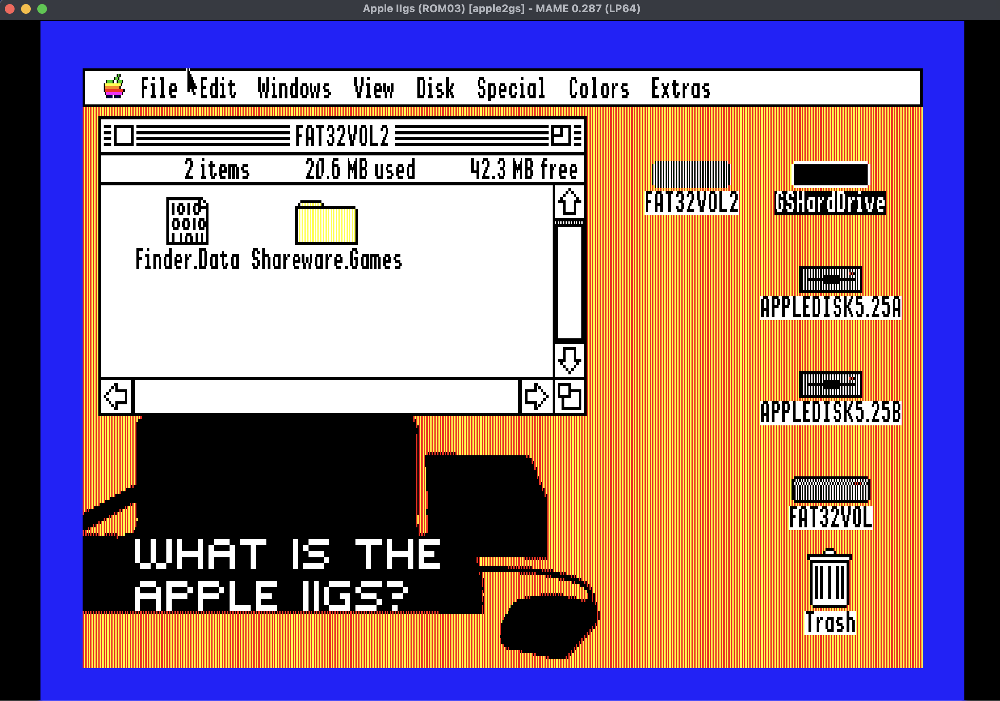

# FAT32 File System Translator for Apple IIGS GS/OS

**Author:** KP (2026)

Mount FAT32 volumes on your Apple IIGS — today, in an emulator. Create a
FAT32 disk image on your Mac, PC, or Linux box, mount it in an emulator like
KEGS or MAME, and GS/OS reads and writes it like a native volume — so you can
move files between vintage and modern machines without per-image conversion.
Support for FAT32 on real storage hardware (CFFA3000, MicroDrive/Turbo) is
still under development and testing — see
[Real-Hardware Status](#real-hardware-status-cffa3000-and-microdrive).  

Test status: 1109 automated tests across phases 0-40 (the registered count in `tests/test_registry.c`), all passing under emulation. See [Building](#build-requirements) and [FAT32TEST](#fat32test-diagnostic-tool-optional) for how to run them (Note I have not released Fat32Test app yet.)

> **Alpha software warning.** Active development. Validated under emulation
> (KEGS and MAME); real-hardware bring-up is in progress but **not yet
> working** — see [Real-Hardware Status](#real-hardware-status-cffa3000-and-microdrive).
> Don't use as the only copy of important data. Keep backups on a separate
> ProDOS volume or your host machine.




*Two FAT32 volumes (FAT32VOL, FAT32VOL2) mounted on the GS/OS Finder desktop under MAME, next to a ProDOS hard drive and 5.25″ floppies — read, written, and browsed like native volumes.*


I will release the source code as soon as i tidy things up and ensure all the build scripts are cleanly portable to other dev environments. 


## Quick Start

[**Download the latest release →**](https://github.com/kpothos/fat32-fst-beta/releases)

- **Try it instantly** — mount `FAT32_FST_GSOS_demo.hdv` in KEGS or MAME and boot; the FST is already installed. Attach a FAT32 volume and it mounts.
- **Install on your own GS/OS** — copy `FAT32.FST` into the `System/FSTs/` folder (file type `$BD`) and reboot. ([full steps](#how-to-install))

Found a bug? Please file it on the [issue tracker](https://github.com/kpothos/fat32-fst-beta/issues). Full documentation is below.

## Why This Project

A weekend itch turned into a long project where I was in way over my head. I always wanted to do
system-level work on the IIGS as a kid but never had the tools or
references; decades later they're all available, and FAT32 was the
piece of the platform I most missed. It was a place I could use some existing expertise and learn a bit about GS/OS prgramming. The result is a fully
read-write FST that gets the IIGS out of the disk-image dance for
file transfer with modern machines.  


## Why This Matters

### On Emulators

Emulators are the current focus while I'm still in alpha, and where the FST is validated today — but they aren't where the real benefit lies. The FAT32 FST works in any Apple IIGS emulator that can mount raw disk images, including KEGS and MAME (and probably others). Create a FAT32 disk image on your Mac or PC, copy files onto it with native tools, and mount it as a block device. GS/OS picks up the volume automatically, with a much larger volume size than ProDOS allows.

Note: some emulators already provide host filesystem access through their own mechanisms — KEGS has Dynapro (virtual ProDOS volumes backed by host directories) and GSplus has the Host FST. If you're already using those, the FAT32 FST is redundant for emulator file transfer. Where it adds value is on real hardware, where no emulator bridge exists; in theory it should work with any emulator that exposes a block device, with no emulator-specific host integration required.

### On Real Hardware

This is my ultimate goal if I can get it to work, hopefully get it right with help from the card makers.

Modern IIGS mass-storage cards — primarily the popular CFFA3000 and the MicroDrive/Turbo (and other raw-block CF/SD adapters) — run on FAT32-formatted CF or SD cards. Those two are the FST's main targets. Today, you create `.PO` ProDOS disk image files on the card and transfer files into them with tools like CiderPress — managing a filesystem within a filesystem.

That's the problem the FAT32 FST is built to solve. This is the goal, and it is not yet working on real hardware ([details](#real-hardware-status-cffa3000-and-microdrive)) — but here's the workflow it aims for. The card's FAT32 filesystem would become your actual working volume: no more juggling multiple 32 MB ProDOS disk images to fit your files, since a single FAT32 volume could hold everything, up to 32 GB. Pull the CF card from your CFFA3000, plug it into your Mac, copy files directly onto the card, put it back, and they would be in the GS/OS Finder — readable and writable. Edit a file on the IIGS, eject the card, and the changes would be visible on your Mac. Both machines share the same filesystem on the same card: no disk image wrappers, no conversion tools, no 32 MB ceiling. The aim is also to launch apps and games from the FAT32 volume directly, without shuttling them to a ProDOS volume. (See Limitations for more.) Once hardware support lands, that is the experience the FST is designed to deliver; today it is validated under emulation.

Part of why it's tricky: the card makers built firmware-level workarounds that intercept GS/OS calls and present a disk-image abstraction layer. They did this on purpose, to compensate for GS/OS's lack of native large-volume support — the same gap FAT32 is meant to fill. So these cards are designed to fake large storage by handing GS/OS disk images, and that design works against what the FST needs: the raw FAT32 blocks underneath. Getting raw block mode exposed cleanly means working against the firmware's whole reason for existing. That's the knot I haven't untied yet.

### Card Configuration

The two cards I focused on first — the MicroDrive/Turbo and the CFFA3000 — expose storage to GS/OS very differently, and that difference largely determines whether the FST gets a usable volume. Neither works yet, but for different reasons: the MicroDrive is promising in theory but not fully tested; the CFFA3000 is tested and blocked. Here's how each card is meant to work, what it would take, and where I've hit a wall. I'm not even sure I can get this working on my own without help from the storage-card companies that still support their products.

#### MicroDrive/Turbo

- **Exposure model:** Always raw block devices — no mode switch.
- **How partitions reach GS/OS:** CF partitions appear directly as raw block devices.
- **Known limitation:** No slot-7 "first two units" limitation; simpler exposure model overall.
- **Status: Untested but promising** — hoping to get it to work, not yet confirmed.

#### CFFA3000

- **Exposure model:** Two modes (raw partitions *or* disk images).
- **How partitions reach GS/OS:** Raw partitions appear as SmartPort units.
- **Known limitation:** In slot 7, GS/OS sees only ~the first two SmartPort units; the 1 GB partitions sit at units 5/6 (after four 32 MB partitions), so they never reach the FST. Disk-image mode caps images at 32 MB.
- **Status: Tested and blocked** — a mountable 1 GB FAT32 volume isn't reachable in either mode today.

I'm leading with the MicroDrive because it looks like the more promising path. Full details on both, and where help is welcome, are in [Real-Hardware Status](#real-hardware-status-cffa3000-and-microdrive).


### CFFA3000

> This describes how the CFFA3000 path is *meant* to work. As of today the FST **cannot mount a FAT32 volume on a CFFA3000.** In raw mode the 1 GB FAT32 partition lands on SmartPort units 5/6, but GS/OS in slot 7 enumerates only ~the first two units, so the volume never reaches the FST. Disk-image mode caps drive images at 32 MB, so it can't host a large FAT32 volume either. See [Real-Hardware Status](#real-hardware-status-cffa3000-and-microdrive) for the full account.

The CFFA3000 has two modes; the FST needs **raw CF mode**, not disk-image mode.

**Raw CF mode** presents the card's partitions directly as GS/OS block devices — the FST reads the MBR at sector 0 and mounts any FAT32 partition it's handed. The catch is the layout: raw mode gives four 32 MB partitions (units 1-4) and then, through a less-obvious firmware option, up to two 1 GB partitions as the *last* one or two slots — which land at units 5/6. Slot 7 only ever exposes the first ~two units, so those 1 GB FAT32 partitions are never offered to the FST, and the firmware won't place a large partition early where slot 7 could see it.

**Disk-image mode** (the default) presents `.PO`/`.2MG` image files on the FAT32-formatted card as SmartPort devices. The CFFA3000 firmware handles the FAT32 filesystem itself — the FST sees only the ProDOS images inside, never the FAT32 data — and each image is capped at 32 MB.

**Switching to raw mode:** CFFA3000 setup menu (hold the button at boot) → "Other Settings → Raw CF Card Settings" → set the partition count → "Erase CF For Raw Use" (manual p.13). This erases the card — and on its own won't produce a mounted FAT32 volume, for the reason above.

**Which mode am I in?** If the Finder shows ProDOS volumes like "GSOS604" or "GAMES," you're in disk-image mode. In working raw mode you'd see the label you gave the card when formatting it on your Mac (e.g. "TESTDISK") — which, on a CFFA3000 today, you won't.

**Other raw-block devices** (Dan ][, SCSI2SD, BlueSCSI, Apple SCSI) should work in principle — anything that exposes a FAT32 partition as a standard GS/OS block device — but real-hardware mounting hasn't worked yet and is sensitive to how each card presents its raw partitions. Reports welcome from testers who know their card's raw-partition layout.

Without help from the card maker to get a RAW block mode access, this might end up being a dead end. 


### MicroDrive/Turbo

I have not gotten the MicroDrive to work either — let me be clear about that up front. But it may be the more promising path, for one reason: its simpler model. The MicroDrive/Turbo always presents CF partitions as raw block devices, with no mode switch to fight. That sidesteps the CFFA3000's slot-7 SmartPort-unit wall (the thing that actually blocks the CFFA3000 today — see below), so on paper it's the cleaner route to handing the FST a real FAT32 block device.

That said, I don't want to oversell it: there are real complexities. Working out — and guaranteeing — that a CF card has the right layout for the MicroDrive is hard, and even confirming whether raw block mode is exposed correctly is hard. This isn't a "format it and it works" situation, and I haven't proven out either piece yet.

The intended workflow is simple: since the MicroDrive/Turbo always presents CF partitions as raw block devices (no mode switch), you would format the CF card as FAT32 on your Mac or PC, insert it, and boot — at which point the FST should auto-detect and mount the volume. That is the expected behavior, but it is untested and unconfirmed; I haven't validated it on real MicroDrive/Turbo hardware. Reports from MicroDrive owners who understand their card's raw-partition layout are especially welcome (see [Real-Hardware Status](#real-hardware-status-cffa3000-and-microdrive)).


### Other Hardware 

I have not experimented with any other storage cards/solutions yet. The process is a bit tediuous, and it requires not just getting my hands on the hardware but a series of serial port debugging probes accross the lifecycle of the detection, visibility of the hardware volume to GS/OS through the device driver and up the the FST layer (and eventually the FAT32 FST).  As i mentioned above all along the way the card firmware tends to not want to allow pure RAW mode because its useless without a high capacity volume support which is what this FST provides.   If I can't get MicroDrive to work I will try another storage card to see if i can get lucky. 

### Features

- **Larger volumes than ProDOS.** ProDOS volumes max out at 32 MB; FAT32 handles volumes up to 2 TB. A software cap currently limits volumes to 32 GB pending real-hardware validation; the cap is a single constant and will be raised as testing progresses. (No realistic IIGS workload exceeds 32 GB.)
- **No special tools needed.** Files on a FAT32 volume are readable by any modern PC, Mac, or Linux machine.
- **Three FAT variants.** FAT12 (legacy floppies), FAT16 (small volumes up to 2 GB), FAT32 (up to 2 TB) — one FST handles all three. Testing has focused on FAT32, with limited FAT16 coverage; FAT12 paths are present but lightly exercised.
- **Long filenames.** VFAT long filenames up to 255 characters, with auto-generated collision-free 8.3 short aliases. The full LFN is preserved on disk even though the Apple IIGS Finder can only display 32 characters — files with longer names show a smart-mangled form (`first20~last11`) in the Finder but remain fully accessible for open, copy, move, and delete.
- **Multiple volumes.** Up to 4 FAT volumes simultaneously — CF on slot 7, SD on slot 5, floppy on slot 6, all on the desktop at once. (The limit is a single constant, `MAX_FAT_VOLS` in `fstdata.c`, set to 4; it was 8 earlier and can be raised again.) Tested with 2 FAT32 volumes mounted concurrently (slot 7 + slot 5). Works with any GS/OS block device (CFFA3000, MicroDrive/Turbo, SCSI2SD, BlueSCSI, Apple SCSI, RAM disks). Each volume must have a unique label — GS/OS requires unique volume names for path resolution. If two share a label, the second silently fails to mount (standard GS/OS behavior, same as ProDOS and HFS FSTs).
- **Full read-write.** Create, copy, rename, move, delete files and folders. The FST blocks writes on volumes that mount dirty (post-crash or unsafe-eject state); pair with host/device read-only modes for the safest workflow.
- **AppleDouble metadata and resource fork support.** ProDOS file types, aux types, access flags, and resource forks are transparently preserved on FAT32 using AppleDouble v2 sidecar files (`._filename`). Fully compatible with macOS and CiderPress II. See [AppleDouble and Resource Fork Support](#appledouble-and-resource-fork-support) for details.
- **Launch GS/OS apps and games directly from FAT32.** GS/OS-native executable types launch from a FAT32 volume the same way they do from ProDOS — double-click in the Finder and the app runs. This includes plain S16 apps (`$B3`, like FloorTiles), extended S16 apps with resource forks (DuelTris, HyperStudio, AppleWorks GS, even the Finder itself), and document types that open via file-type association (TXT, GWP, graphics). Copy a ProDOS app to the FAT32 volume with the Finder's drag-and-drop — data fork, resource fork, and ProDOS metadata all go through in one operation — and launch it. Load-as-data types (RTL `$B5`, LDF `$BC`, FST `$BD`) also load correctly when referenced by a running app. The one exception is ProDOS 8 binaries (`$04`/`$06`/`$FC`/`$FF`), which require GS/OS to shut down and hand over to P8 — a platform constraint no non-ProDOS FST can work around. See [Launching Applications from FAT32](#launching-applications-from-fat32) for the full table.
- **JIT Filetype Sniffer.** Files without sidecars are identified automatically from their content headers. The FST recognizes 15 file formats including OMF executables (S16), ShrinkIt/NuFX archives, Binary II, GIF, TIFF, BMP, WAV, AIFF, PDF, ZIP, and plain text. Sniffed types are returned in-memory to GetFileInfo, Open, and GetDirEntry — so raw files dragged onto a CF card from a modern computer show correct icons and types in the Finder and launch correctly with no manual setup. Sniff results are intentionally not persisted to disk; read-class operations (Open, GetFileInfo, GetDirEntry) are pure-read, matching HFS and ProDOS semantics. ProDOS metadata is persisted only through explicit paths (SetFileInfo, Create-with-type, resource-fork write, or host-placed sidecar).

### System Requirements

- **Minimum: 1.25 MB RAM** (ROM 01 with Apple Memory Expansion Card, or ROM 03). The release FST binary is ~210 KB on disk. (The development/test build, which adds fault-injection and trace code, is ~350 KB.) With GS/OS, the Finder, and standard FSTs consuming ~600 KB, a 1 MB system still has working memory after loading the FAT32 FST — enough to browse and copy files, though tight for large directory listings or multiple open files. 1.25 MB gives comfortable headroom.
- **Recommended: 2 MB or more** for heavy use (multiple FAT volumes, large directories, third-party applications running alongside FAT32 access).
- **Not supported: 256 KB or 512 KB systems.** GS/OS 6.0.1 itself requires 1 MB minimum.
- **ROM 01 and ROM 03 both supported.** No ROM-specific code.

### Minimum Memory by Configuration

The table below summarizes what each IIGS memory configuration can comfortably do with the FAT32 FST installed. The release FST binary is ~210 KB on disk and loads into RAM as code + data segments. Runtime additions: per-volume caches (GDE, FAT block, DMA buffers — about 33-40 KB per mounted FAT volume), plus the usual GS/OS overhead.

| Memory | GS/OS 6.0.1 | + FAT32 FST | Verdict |
|---|---|---|---|
| **256 KB** (stock ROM 01) | Won't boot GS/OS | — | Not supported |
| **512 KB** | Boots GS/OS 1.x, not 6.0.1 | — | Not enough |
| **1 MB** (typical ROM 01 + memory card) | Boots GS/OS 6.0.1 | Fits + light app use | Bare minimum |
| **1.125 MB** (ROM 03 stock) | GS/OS 6.0.1 + Finder | Works for file ops | Functional minimum |
| **2 MB** | Plenty | Apps work | Comfortable |
| **4 MB** (KEGS/MAME default) | Plenty | Heavy use | Recommended |

FST footprint per mounted volume (release binary):

| Active state | Approximate runtime memory |
|---|---|
| FST loaded, no volumes mounted | ~210 KB |
| FST loaded, 1 volume mounted | ~250 KB |
| FST loaded, 2 volumes mounted | ~290 KB |
| FST loaded, 4 volumes mounted (max) | ~370 KB |

Worst-case "FAT32 FST + Finder + one FAT volume + app" budget:

```
GS/OS kernel:         260 KB
Finder:               200 KB
ProDOS FST:            30 KB
HFS FST:               80 KB
FAT32 FST + 1 vol:    250 KB
App working RAM:      100 KB
-----------
Total:               ~920 KB
```

A 1 MB system fits this with a little room to spare: GS/OS + Finder + a single FAT volume + minimal app working memory lands just under the 1 MB ceiling. Stepping up to 2 MB roughly doubles the headroom for applications, multiple open files, and larger directory caches.

### Important: Finder Special Menu Limitations

The Finder's Special menu has options that do not work with FAT32 volumes:

- **Verify — do not use.** Clicking Verify on a FAT32 volume crashes GS/OS and forces a reboot. This appears to be a GS/OS kernel bug affecting all non-Apple FSTs, not a bug in this FST. There is no workaround. Eventually I might create a CDA to do these things.
- **Initialize (Erase Disk)** — does nothing on FAT32 volumes. GS/OS only dispatches format operations to Apple-format FSTs. To erase a FAT32 volume, reformat it on your Mac/PC.

All other Finder operations (copy, move, delete, rename, Get Info, open, create folders) work normally.

### Volume Integrity Protection

The FST protects volumes that arrive already marked dirty. If a FAT32 volume's dirty bit is set at mount (for example after a crash or an unsafe eject on another machine), the FST mounts it read-only. You can browse files and copy data off, but Create, Write, Delete, and Rename are blocked until the volume is verified.

Today this protection is one-way: the code that would proactively mark a previously-clean volume "in use" during IIGS operation is still being reworked, so safe ejects and backups still matter.

To restore read-write access, verify and repair the volume using your host OS tools:

**Physical media (CF/SD cards):** Use your modern OS's built-in disk tools directly — `fsck_msdos` on macOS, `fsck.fat` on Linux, or `chkdsk` on Windows. No special steps needed.

**For those who want to test using KEGS 2IMG disk images (you can use any disk image type, these are just instructions for 2MG types):** The 2IMG format has a 64-byte header that FAT tools don't understand. Strip it first, run fsck, then reattach it:

```bash
# Strip 2IMG header 
python3 -c "open('/tmp/r.img','wb').write(open('your_volume.2mg','rb').read()[64:])"

# Verify (read-only check)
fsck_msdos -n /tmp/r.img        # macOS
fsck.fat -n /tmp/r.img          # Linux

# Repair (clears dirty bit)
fsck_msdos -y /tmp/r.img        # macOS
fsck.fat -a /tmp/r.img          # Linux

# Reattach 2IMG header
python3 -c "
img = open('your_volume.2mg','rb').read()
raw = open('/tmp/r.img','rb').read()
open('your_volume.2mg','wb').write(img[:64] + raw)
"
```

The next mount on the IIGS will see a clean volume and allow full read-write access. You can google similar instructions for other image types (HDV, etc)

### Known Limitations

- **256-byte pathname limit.** This is a GS/OS platform limit (`GSString255`), not a FAT32 restriction. All FSTs on the IIGS share it. The full colon-separated path (e.g., `:FAT32VOL:DIR:SUBDIR:FILE.TXT`) must fit in 256 bytes. With short directory names you can nest ~120 levels deep; with 8-character names, about ~28 levels. The FAT32 spec itself has no path length limit, so files created on Mac/Linux/Windows with deeper paths will be visible but partially unreachable from GS/OS — see the behavior table below.

  What a GS/OS user sees when a FAT32 volume contains files at paths longer than 255 bytes (e.g., a modern-created tree like `Documents/Projects/2024/Client-A/Subdir/.../Report.txt` at 400 bytes of colon-separated path):
  - **Finder browsing:** navigate into the parent directory → the file is visible in the window, with its full filename (or 32-char mangled form if the component is long). No crash, no error. Enumeration walks the directory one entry at a time and never needs the full path string.
  - **Finder double-click:** fails cleanly. The Finder tries to build the absolute path to pass to the launched app; it exceeds 255 bytes → GS/OS itself returns `$004B badPathSyntax` → the Finder pops its standard "can't open this item" dialog. The FST is never even invoked. No data touched.
  - **Finder drag-to-copy / drag-to-trash:** same as double-click — `badPathSyntax` at the OS layer, clean error dialog, no FST involvement, nothing deleted or partially written.
  - **Programmatic access from inside the deep directory** (e.g., an app that's already `Open`ed the parent folder and uses a short relative leaf name): works normally. The path passed to the FST is just the leaf, well under 255 bytes. Create, read, write, delete all function fully.
  - **CLI/shell tools:** whatever the tool can express in ≤255 bytes is accessible; anything longer returns the same OS-level `badPathSyntax`.

  In short: no crashes, no data corruption, no silent misbehavior — the OS rejects oversized paths before they reach any FST. Deeply-nested modern-created files simply behave as "visible-but-not-launchable" from the Finder, while remaining fully usable via relative access inside their parent directory.
- **Finder 32-character filename limit.** The Apple IIGS Finder passes a 36-byte name buffer to GetDirEntry, limiting displayed filenames to 32 characters. Files with longer names display with a smart-mangled name (`first20~last11`) and are fully accessible for open, copy, move, and delete. See [Long Filename and Long Pathname Limitations](#long-filename-and-long-pathname-limitations) for details.
- **AppleDouble sidecar visibility in large directories.** Directories with more than ~500 files may show `._` sidecar files in the Finder listing for entries beyond the directory cache. This is cosmetic only — sidecar files cannot be opened or copied by the user. Cleanup: run `dot_clean` on macOS, or wait for the planned FSCK CDA. Virtually all real-world IIGS directories are well under this limit. The cap is tied to the 1 MB-RAM minimum target; raising it would require more memory.
- **GetDirEntry sidecar matching uses 31-character name prefix.** The sidecar type cache matches `._` files to primary files using the first 31 characters of each name. Two files in the same directory whose names are identical for the first 31 characters could receive the wrong cached type. This requires an extraordinarily unlikely naming collision — virtually impossible on a real IIGS directory.
- **Trailing periods in filenames are not preserved on FAT32.** ProDOS allows filenames to end with one or more `.` characters (e.g., `YES.`, `NOTES..`). FAT32 — and most modern filesystems including NTFS, exFAT, and HFS+/APFS — strip or refuse trailing periods because Microsoft's FAT/Win32 layer canonicalizes them away (Windows treats a trailing period as a "no extension" marker, not data). When an IIGS file with trailing dots is copied onto a FAT32 volume, the dots drop from the on-disk LFN; the file stays accessible under the dot-less name. The same applies to filenames ending in ASCII space, which FAT32 also strips. This is an inherent format difference, not a FST defect — the same data round-tripped through any other modern OS produces the same result.
- **Duplicate volume labels not supported.** Two FAT volumes with the same label cannot both be mounted. The second volume's mount returns `dupVolume` and the volume does not appear in Finder. Ensure each volume has a unique label.
- **32GB volume size limit (software cap).** The FST's 32-bit sector arithmetic supports volumes up to 2TB in theory, but testing has only been done up to 32GB. A software limiter in IdentifyVolume rejects volumes larger than 32GB (67,108,864 sectors) as a safety measure until larger volumes can be validated. Practical IIGS storage (CFFA3000, MicroDrive/Turbo) typically uses 2-8GB CF/SD cards, well within this limit. The cap will be raised as testing progresses.
- **Some unusual pathname spellings can still confuse a few GS/OS programs.** FAT32 now correctly treats letter-case differences and 8.3 short names vs long VFAT names as the same file. The remaining edge cases are uncommon program-generated path spellings, especially mixing slash-style and colon-style separators for the same file. Finder and normal double-click launches already use normalized paths, so everyday use is unaffected.
- **Cannot launch ProDOS 8 (P8) binaries/executables from a FAT32 volume.** This is a GS/OS + ProDOS platform limitation, not a FST restriction. When GS/OS is asked to launch a P8 file (BIN/SYS/BAS, fileTypes `$04`/`$06`/`$FC`/`$FF`/etc.), it shuts itself down and hands the machine to ProDOS 8 — a 16-bit-block-driver OS that knows only ProDOS-formatted volumes. Once GS/OS is no longer running, every non-ProDOS FST (FAT32, HFS, and the rest) stops dispatching, so the volume the P8 binary was launched *from* is no longer readable, and ProDOS 8 has no path back to FAT32 data. Launch attempts produce a "cannot launch" error at the GS/OS level before the FST is ever invoked. GS/OS-native apps (S16 `$B3`, S16+ extended, scripts, documents) launch normally from FAT32 because they run *under* GS/OS and the FST stays active. Workaround for P8 apps: copy them to a ProDOS volume first, or run them from their original ProDOS disk.

### Tips for Best Results

- **Keep filenames under 32 characters** when creating files on the IIGS or when the volume will be shared with GS/OS. Names under 32 characters display and operate normally; longer names display with a shortened form showing the beginning and end of the filename.
- **Keep total path depth under 255 bytes.** Count the volume name, every colon separator, every directory name, and the filename. Example: `:FAT32VOL:Documents:Projects:Report.txt` is 40 bytes. Deeply nested folders with long names created on modern systems may exceed this limit, making those files unreachable from the IIGS.
- **Files created on Windows, macOS, or Linux work.** The FST stores and reads long filenames up to 255 characters. You can freely create files and folder structures on a modern OS and access them from the IIGS.
- **ProDOS apps with resource forks copy fully.** The Finder preserves resource forks via AppleDouble sidecars. S16 apps ($B3) launch from FAT32. EXE apps ($B5) with code in the resource fork also work if copied via the Finder (which preserves the resource fork in the sidecar).
- **If you get $0046 (fileNotFound) or $0044 (pathNotFound)**, the GS/OS pathname likely exceeded 255 bytes. Shortening directory or file names on another operating system will resolve the issue.

## AppleDouble and Resource Fork Support

The FAT32 filesystem has no concept of resource forks or ProDOS file types. The FST bridges this gap using AppleDouble v2 sidecar files — the same `._filename` convention macOS uses when writing to FAT/exFAT volumes. This makes the FST compatible with CiderPress II and macOS.

### How It Works

When a file's metadata is set (via SetFileInfo, a Finder copy, or resource-fork write), the FST creates a hidden sidecar file named `._filename` in the same directory. Fresh-create sidecars use a 256-byte rich header that carries four AppleDouble v2 entries: entry 11 (ProDOS File Info — access, fileType, auxType in big-endian), entry 8 (file dates), entry 9 (Finder Info, with ProDOS type/aux encoded via the CiderPress II `pdos` creator convention so macOS Finder and CiderPress II both see the type immediately), and a zero-length entry 2 placeholder for the resource fork. Entry 8 uses the current clock for create/modify/access times and leaves backup time as "unknown". When a resource fork is present, its bytes begin at offset `$100` (the end of the rich header). The sidecar is invisible in the Finder — it has FAT ATTR_HIDDEN and ATTR_SYSTEM attributes, and GetDirEntry filters it from directory listings.

When an existing sidecar is upgraded to hold a resource fork (e.g., the first rfork-open-for-write on a file whose sidecar was previously metadata-only), the FST uses a copy-through strategy: the old sidecar's header sector is read byte-for-byte into a staging buffer, a new entry 2 (resource fork) descriptor is patched in, and the buffer is written to a freshly-allocated cluster. Every pre-existing entry — including entries 8, 9, 10, 12, 13 written by macOS or CP2 — stays byte-exact at its original offset. No metadata is discarded on upgrade.

Sidecar creation is driven only by explicit caller intent. The FST never creates `._filename` sidecars as a side effect of reading or launching a file; read-class operations (Open, GetFileInfo, GetDirEntry, Read, Close) are pure-read. Sidecars come into existence only when:

- The caller invokes `SetFileInfo` to persist ProDOS type/aux/access.
- The caller opens the resource fork for write (`resourceNumber=1` with write access) — the FST creates the sidecar to hold the resource fork bytes.
- A host-side tool (macOS Finder, CiderPress II, `mcopy`, etc.) writes the `._filename` file directly to the FAT32 volume.

This matches the pure-read semantics of HFS and ProDOS: opening a file never mutates disk state.

### JIT File Type Detection (aka "JIT Sniffer")

Files without sidecars (e.g., raw files dragged onto a CF card from a Mac) are identified automatically on first access. The FST reads the first 512 bytes and checks for known content signatures:

- **OMF executables** — structural validation of BYTECNT, NUMLEN, VERSION, BANKSIZE, KIND fields. Detected as S16 ($B3). These apps can launch directly from FAT32.
- **ShrinkIt/NuFX archives** — magic bytes $4E $F5 $46 $E9. Detected as $E0/$8002.
- **Binary II archives** — magic bytes $0A $47 $4C. Detected as $E0/$8000.
- **Images** — GIF ($C0/$8006), BMP ($C0/$8005), TIFF LE/BE ($C0/$8005).
- **Audio** — WAV ($D8/$0000), AIFF ($D8/$0000).
- **Text** — all printable ASCII in first 256 bytes → $04/$0000.
- **AppleSingle** — detected as $E0/$0001 but NO sidecar created (the file is already a metadata wrapper).

Sniff results are returned in-memory to the caller (GetFileInfo, Open, GetDirEntry) but are not persisted to disk. Every Open / GetFileInfo / GetDirEntry on a sniffable file pays one 512-byte ReadSector to re-sniff — cheap and self-correcting. If the file's content later changes (e.g., an app update overwrites an OMF with a new OMF), the type reflects the new content immediately rather than being pinned to a stale sidecar. Disk state only accumulates sidecars that were placed there by explicit persistence paths (SetFileInfo, resource-fork write, host tools). On read-only volumes, the type is still returned correctly via the same in-memory sniff.

### Launching Applications from FAT32

- **S16 apps ($B3)** — code lives entirely in the data fork. JIT detection identifies the OMF header, and the app launches normally from the Finder. No sidecar preparation needed.
- **EXE apps ($B5)** — code is split between the data fork and resource fork. The resource fork contains essential code segments that cannot be recovered by content sniffing. These apps require proper preparation (see below).

#### Supported executable types

GS/OS-native executable types launch from a FAT32 volume the same way they launch from ProDOS.

**Directly launchable from Finder (run under GS/OS):**

| Type | Name | Status |
|------|------|--------|
| `$B3` | S16 (plain 16-bit GS/OS app) | ✅ Works (FloorTiles, AppleWorks GS, and similar GS/OS apps) |
| `$B3` + rfork | S16+ (extended, with resource fork) | ✅ Works (DuelTris, HyperStudio, Finder itself, etc.) |
| `$04`–`$C1` etc. | GS/OS documents (TXT, GWP+, pic, etc.) | ✅ Launch via file-type association into a GS/OS app |

**Load-as-data (consumed by an app, not launched directly):**

| Type | Name | Status |
|------|------|--------|
| `$B5` | RTL (run-time library) | ✅ Works — read as data by the app that needs it |
| `$BC` | LDF (generic loadable) | ✅ Works |
| `$BD` | FST | ✅ Works — the FAT32 FST itself is loaded this way |
| `$BA` | TOL (tool set) | ✅ Works |
| `$BB` | DVR (device driver) | ✅ Works |
| `$B8` | NDA (new desk accessory) | ✅ Works |
| `$B9` | CDA (classic desk accessory) | ✅ Works |
| `$B6`, `$B7` | PIF/TIF (init files) | ✅ Works (typically read at boot from `:BOOT:SYSTEM:SYSTEM.SETUP`) |

**Not supported — GS/OS + ProDOS 8 platform limitation** (see the "Cannot launch ProDOS 8 (P8) binaries/executables from a FAT32 volume" entry in Known Limitations above):

| Type | Name | Why it fails |
|------|------|--------------|
| `$FF` | SYS (ProDOS 8 system file) | GS/OS shuts itself down to hand off to ProDOS 8; FAT32 FST stops running |
| `$FC` | BAS (Applesoft BASIC) | Runs under ProDOS 8 (BASIC.System) |
| `$FA` | INT (Integer BASIC) | Runs under ProDOS 8 |
| `$06` | BIN — when it's a P8 binary | Same reason (note: `$06` is ambiguous — some S16 apps also use `$06`; `$B3` is the canonical S16 type) |
| `$EF` | PAS (Pascal code) | Pascal system, not GS/OS |

No FST can work around the P8 gap — it's architectural. Any non-ProDOS FST (FAT32, HFS, SMB, etc.) loses dispatch once GS/OS shuts down to hand control to ProDOS 8. Workaround: copy P8 apps to a ProDOS volume and launch from there.

### Getting Files onto FAT32 with Correct Types and Resource Forks

FAT32 has no native concept of file types or resource forks. The FST uses AppleDouble v2 sidecar files (`._filename`) to store this metadata. For the sidecars to exist with correct data, files must be transferred using an AppleDouble-aware method. Here are all the supported ways:

#### On the Apple IIGS

1. **Finder drag-and-drop (ProDOS to FAT32)** — the most natural method. Open both volumes in the Finder, drag files from a ProDOS volume to the FAT32 volume. GS/OS automatically copies both the data fork and resource fork. The FST creates the `._` sidecar with the correct ProDOS file type, aux type, access flags, and full resource fork data. Round-trip: copy back from FAT32 to ProDOS and the file is identical to the original. Of course this is invisible to Finder, but the sidecar files are there and the FAT32 FST knows how to access them when GS/OS needs the info contained within them.

2. **Finder drag-and-drop (HFS to FAT32)** — same as above. Any GS/OS FST that supports resource forks (HFS, ProDOS) works as a source. The Finder handles the fork copying transparently.

3. **Finder drag-and-drop (FAT32 to FAT32)** — copying between two mounted FAT32 volumes preserves sidecars. The Finder reads the resource fork from the source sidecar and writes it to the destination sidecar.

4. **Programmatic GS/OS calls** — any application that uses the standard GS/OS Open/Read/Write/Close sequence with `resourceNumber=1` will correctly read and write resource forks on FAT32. The FST handles all sidecar management transparently. Applications do not need to know about AppleDouble.

#### On a Modern Computer (Mac, Windows, Linux)

5. **CiderPress II (recommended)** — use CiderPress II's AppleDouble export mode to extract files from disk images onto a FAT32-formatted CF/SD card. CiderPress II writes the data fork as the primary file and creates a `._` sidecar with AppleDouble v2 format containing entry ID 11 (ProDOS File Info) and entry ID 2 (Resource Fork). The FST reads these sidecars natively. This is the best method for preparing a card on a modern computer — CiderPress II understands ProDOS metadata and resource forks, and its AppleDouble output is fully compatible with the FST.

6. **macOS Finder copy** — when macOS copies a file with extended attributes or resource forks to a FAT32 volume, it automatically creates `._` sidecar files. These sidecars use AppleDouble v2 and typically include Finder Info (entry ID 9) alongside resource fork data (entry ID 2), but no ProDOS-specific entry ID 11. The FST still recovers the ProDOS fileType and auxType from these sidecars: when entry 11 is absent, the FST decodes entry 9 using the CiderPress II `pdos` Finder Info convention (HFS type field = `'p'` + proType + proAux BE16, HFS creator = `"pdos"`) and returns the same type/aux that CP2 would report. Resource fork bytes are extracted from entry 2 as before. The net effect is that most macOS-written sidecars carrying a pdos-tagged Finder Info yield the correct ProDOS type without falling back to extension mapping or JIT sniffing.

7. **Manual sidecar creation** — for advanced users, you can create `._` sidecar files manually using any tool that writes the AppleDouble v2 binary format. The FST expects: signature `$00051607`, version `$00020000`, entry ID 11 at any position in the entry table (8 bytes: access + fileType + auxType in big-endian), and optionally entry ID 2 for resource fork data. The sidecar must have the same name as the primary file with `._` prepended. Entry bodies may live past sector 0 — the FST walks the sidecar's cluster chain via `FATGetEntry` to read entries placed at arbitrary offsets, matching CiderPress II's layout behavior. If entry 11 is absent but entry 9 carries a pdos-tagged Finder Info, the FST recovers the ProDOS type/aux from entry 9 instead.

#### Methods That Do NOT Preserve Metadata

- **Plain file copy on Mac/Windows/Linux** (e.g., `cp`, drag in Windows Explorer, `rsync` without `-E`) — copies only the data fork. No sidecar is created. The file will work but the FST will use extension-based type mapping or JIT sniffing. Resource forks are lost.
- **`tar`, `zip`, most archive tools** — strip resource forks unless specifically configured for AppleDouble or AppleSingle preservation.
- **FTP, SCP, cloud sync** — data fork only. Resource forks are lost in transit.

For any file that arrives on FAT32 without a sidecar, the JIT sniffer will attempt to identify the file type from its content headers. This works well for S16 executables, ShrinkIt archives, images, and text files. But resource fork data cannot be recovered by sniffing — it must be explicitly transferred using one of the methods above.

### What the JIT Sniffer Cannot Do

The JIT sniffer identifies what a file is, not what data it contains. It can label a file as "this is an S16 executable" by reading the OMF header, but it cannot reconstruct a missing resource fork. If an EXE app's resource fork was never copied to the FAT32 volume, the code segments simply don't exist on disk — no amount of header analysis can recover them. For these files, use one of the preparation methods above.

## Current Status: Read-Write Alpha

The FAT32 FST supports full read-write operations on FAT volumes. All core GS/OS file operations are implemented: Open, Close, Read, Write, Create, Destroy, SetFileInfo, SetEOF, GetEOF, SetMark, GetMark, GetFileInfo, GetDirEntry, ChangePath (rename/move), Volume, Flush, JudgeName, Format, EraseDisk, and GetDevNumber. The codebase should be considered alpha quality — the diagnostic test suite exercises every operation including file creation, directory hierarchy, filename edge cases, file modification, move/rename, deletion, error handling, structure validation, cache coherence, spec compliance, platform limits, AppleDouble sidecar behavior, launch workflows, pure-read file-type sniffing, explicit metadata persistence paths, and external-audit regression fixes. Active testing and bug-fixing are ongoing.

**Performance:** the FST works but is not yet speed-optimized — correctness came first. Several hot paths (FAT chain traversal, directory enumeration, caching) still have headroom; performance tuning is ongoing, and throughput should improve in later releases.

**Cross-platform round-trip validation:** Files created on macOS and copied to the FAT32 volume have been verified by computing CRC32 checksums on the host, mounting the volume in GS/OS, reading the files back, and comparing checksums. All data matches byte-for-byte.

**End-to-end app launch from FAT32 (2026-04-19):** Copied an EXE/$B5 application from a ProDOS volume to a FAT32 volume using the GS/OS Finder (drag-and-drop), then launched it from the FAT32 volume by double-click. The Finder-driven copy went through Create (primary) → Open/Write (data fork) → Open/Write (resource fork, triggering the FST's rfork-upgrade path) → SetFileInfo (sidecar entry 11). Both the data fork and the resource fork landed correctly on disk; the sidecar stored the full ProDOS type/aux/access metadata; and GS/OS's Loader read them back to launch the app. This exercises the full stack end-to-end — SFI metadata preservation, rfork-upgrade atomic commit, pure-read Open, and GS/OS Loader's fork-aware open sequence — against a real user workflow, not just the test suite.

**Tested on:** KEGS (KEGSMAC 1.0 on macOS) and MAME (via Ample 0.287-u2, using its CFFA 2.0 `a2cffa02` card emulation for a raw FAT32 block device), both with GS/OS 6.0.1 and 6.0.4. Real-hardware bring-up on a CFFA3000 is actively underway but does not yet work — see [Real-Hardware Status](#real-hardware-status-cffa3000-and-microdrive).

**Hardware compatibility note ( not yet working):** The FAT32 FST requires that the storage device's driver presents a standard GS/OS block device interface. The FST issues standard block-level Read and Write calls through GS/OS device dispatch — it does not use any vendor-specific commands or firmware features. Storage adapters (CFFA3000, MicroDrive/Turbo, Focus, etc.) must support native block-mode I/O through GS/OS without intercepting or translating filesystem-level calls. Adapters that implement their own FAT translation layer (presenting a ProDOS-style interface instead of raw block access to the FAT volume) will not work with this FST. Part of the hardware smoke testing process is to verify which adapters provide the required raw block access and to compare what the card shows on a Mac/Windows/Linux host with what GS/OS sees through the FST — they must match.

## What's in the Distribution

The download includes two things:

- **FAT32.FST** — the file system translator (release build, ~210 KB). Install it to `System/FSTs/` on your own GS/OS boot disk (see [How to Install](#how-to-install) below).
- **Turnkey GS/OS image** — a bootable GS/OS disk image with the FST already installed. Mount it in an emulator (MAME, KEGS, or GSplus) and boot — no setup; attach a FAT32 volume and the FST mounts it.

## How to Install

1. Copy `FAT32.FST` (the ~210 KB release build) into the `System/FSTs/` folder on your GS/OS boot disk. (Built from source, it's `obj/release/FAT32.FST`; the larger debug `obj/FAT32.FST` is for FAT32TEST only.)
2. Reboot.

GS/OS loads all FSTs from `System/FSTs/` at boot; the FAT32 FST then scans every block device and mounts any FAT volumes it finds.

The file must be GS/OS file type `$BD` (FST) — that is what tells GS/OS to load it. It is already `$BD` in the repo; if you transfer it with a tool that drops the ProDOS type (e.g. a plain byte-copy on a non-Apple host), set the type back to `$BD` before rebooting.

## Alpha Test Ideas 

Any testing under emulation, and real-world use (browsing, copying, renaming, and launching files in the Finder), is appreciated and open to everyone — that's the easiest and most valuable way to help. I've built a fairly comprehensive test suite covering the FAT32 logic; what's harder for me to cover is compatibility, configurations I didn't anticipate, and edge cases.

**Hardware testing is different — please read this first.** Whether a FAT32 volume mounts on real hardware turns out to hinge entirely on how each storage card exposes *raw block mode* to GS/OS (see [Real-Hardware Status](#real-hardware-status-cffa3000-and-microdrive)), and the cards I've tried don't work yet. So I'm **not** looking for casual hardware testers right now — without a solid grasp of how your card carves and exposes partitions, you'll most likely just reformat a CF card and hit the same wall I have. But if you *do* deeply understand storage-card internals — raw-partition layout, how units map to GS/OS device numbers, how partitions are expected to be structured — I'd genuinely love your help (see below).


### FAT32TEST Diagnostic Tool (Optional)

If you want a more thorough test, the `FAT32TEST` application is included in the repository. It's a standalone GS/OS program that runs hundreds of automated tests covering every FST operation — file creation, reading, writing, deletion, renaming, directory traversal, cross-volume copy, checksum verification, cluster leak detection, and more — on both real hardware and emulators, exercising happy paths and many kinds of edge cases.

Requirements: 4 MB of RAM. The suite is a large S16 application (~2 MB binary plus working buffers) and runs out of memory below 4 MB, so a stock 1 MB IIGS — or even a 2 MB one — will fail to launch it. A IIGS with a RAM expansion card bringing total RAM to 4 MB (GS-RAM, RamFAST, or similar) is required. KEGS and other emulators default to 8 MB, so this is only a concern on real hardware.

**How to use it:**

1. Copy `FAT32TEST` (type $B3) to the root of your GS/OS boot disk.
2. Create or mount a fresh, empty FAT32 volume of at least 64 MB. The test needs an empty volume to establish a free-space baseline.
3. Launch `FAT32TEST` from the Finder. It runs unattended — no interaction needed. Tests take several minutes depending on your machine speed.
4. When it finishes, it displays a summary (passed/failed/skipped) and writes a detailed log to `FAT32TEST.LOG` on your boot volume.

**Send me your results.** Whether the tests all pass or some fail, the log file is valuable. Please send:
- The `FAT32TEST.LOG` file (or a photo of the summary screen)
- Your hardware configuration (ROM version, RAM size, storage device type, accelerator if any)
- Any crashes or GS/OS error dialogs you saw, even if the log file didn't capture them — note the error code (e.g., `$004E`) and what was on screen when it happened

You don't have to use FAT32TEST — your own real-world testing (browsing, copying, renaming files in the Finder) is equally valuable. Any bug report helps.

## What Doesn't Work Yet

- **GPT partition tables** — only MBR is supported. GPT is probably rare on IIGS-targeted media.
- **EXE apps ($B5) require preparation** — EXE applications store executable code in the resource fork. The FST fully reads and writes resource forks via AppleDouble sidecars, so EXE apps work when copied via the Finder from a ProDOS volume or prepared with CiderPress II. But if a raw EXE binary is placed on the CF card without its resource fork (e.g., a plain file copy on a Mac without CiderPress), the code segments are missing and the app won't launch. This is not a software limitation — the data was never transferred. See [AppleDouble and Resource Fork Support](#appledouble-and-resource-fork-support).
- **ProDOS 8 compatibility — untested.** The FST is built for GS/OS only. Adding ProDOS 8 support would mean handling the Class-0 (no `pCount`) variants of every call, smaller FCRs, and the lack of Extended SmartPort (32-bit block addresses). It approximately doubles the test surface. Not implemented; ProDOS 8 callers will hit `paramRangeErr` or behave unpredictably.
- **HFS / AppleDouble v2 interop polish — partially tested.** Cross-FST file copy (e.g., Finder drag from a FAT32 volume to an HFS volume, or vice versa) works for common cases but has ~3-4 known edge cases where the Finder displays a confusing prompt or transfers metadata incompletely. These are minor visual glitches, not data loss, and are queued for a future polish pass.

## Known Limitations

- **Duplicate volume names prevent mounting.** GS/OS requires unique volume names across all mounted volumes. If two FAT32 volumes share a label (set during formatting), only the first one detected during the startup device scan mounts — the second is silently skipped with `dupVolume`. This is standard GS/OS behavior (ProDOS and HFS FSTs do the same). To fix: rename one volume's label with a PC/Mac disk utility before inserting both media. The FST does not auto-rename or warn at mount time.

- **AppleDouble v1 sidecars are NOT read.** The FST only parses AppleDouble v2 sidecars (signature `$00051607`). AppleDouble v1 files (signature `$00051601`, produced by CiderPress 1.x and some older BSD/early-Mac tools) are silently ignored — no crash, no error, no hang. Runtime behavior depends on the access path:
  - **Reads** (GetFileInfo, data-fork Open, rfork Open read-only): v1 sidecars are treated as if they don't exist. The primary file's type falls back to extension-map or content-sniff derivation. The v1 sidecar on disk is not modified or deleted.
  - **Rfork Open for write**: the v1 sidecar is deleted and a fresh v2 sidecar is created in its place. Any ProDOS metadata stored inside the v1 sidecar is lost at this point (we cannot read it, so we cannot preserve it).

  This choice is deliberate: v1's entry-ID-7 "ProDOS Info" layout has a variable-length "home filesystem" prefix that makes fixed-offset parsing fragile, and v1 is essentially extinct in modern workflows (CiderPress II and macOS both produce v2). If you have v1-formatted AppleDouble files and need their metadata preserved, convert them to v2 with CiderPress II before copying to a FAT32 volume.

## Tested Configurations

This FST has been validated under two emulators — **KEGS** (KEGSMAC 1.0 on macOS) and **MAME** (via Ample 0.287-u2, using its CFFA 2.0 `a2cffa02` card emulation to present a raw FAT32 block device) — both running GS/OS 6.0.1 and 6.0.4, with the full automated suite passing. Real-hardware testing is **actively in progress but not yet working** (see below).

### Real-Hardware Status: CFFA3000 and MicroDrive

Real-hardware bring-up is **actively in progress**, but the FST does **not yet mount a FAT32 volume on real hardware.** The obstacle is *how these cards expose raw block mode to GS/OS* — not the FST itself. The FST loads and runs correctly on the IIGS (verified over the SCC serial trace); it is simply never handed the FAT32 block device by the card in the configurations tried so far.

**Where it works — emulation:** validated under **KEGS** (KEGSMAC 1.0, raw FAT32 disk images) and **MAME** (Ample 0.287-u2, using MAME's CFFA 2.0 `a2cffa02` card emulation to expose a raw FAT32 block device), both on **GS/OS 6.0.1 and 6.0.4**, with the full automated suite passing.

**CFFA3000 (slot 7, raw-partitions mode):** the card's 1 GB raw partitions are always partition #5/#6 — they follow the four 32 MB partitions, so they land on SmartPort *units 5/6*. GS/OS in slot 7 only enumerates the **first ~2 SmartPort units**, so the 1 GB FAT32 partition is never offered to any FST. (The card's *disk-image* mode is no help either — it caps SmartPort drive images at 32 MB.) Placing a small FAT volume in the first unit, and trying other slots, are the avenues currently under investigation.

**MicroDrive/Turbo:** testing is pending. It presents CF partitions as raw block devices, so it is the leading candidate for a working real-hardware configuration — reports from MicroDrive owners are especially welcome.

**This is expert territory right now.** If you deeply understand how your storage card exposes raw partitions to GS/OS — how units map to device numbers, where partitions are expected to start, how the card reports them over SmartPort — then a report on the layout you tried and whether the FST was offered the volume would be genuinely valuable. If that's not you, this isn't a productive place to start (you'll most likely just reformat a CF card and hit the same wall); emulator and real-world usage testing is the better way to help.

**Where I most need help: testing:**

- **Emulators:**  Multi-volume FAT32 mounts and inter-volume testing are especially useful, as is round-tripping files between what the host sees and what GS/OS sees.
- **Real-world use:** browse, copy, rename, and launch files from a FAT32 volume in the Finder, and report anything odd.
- **Your own favorite emulator config.**

**Where I need help — anyone with deep storage-card expertise** (see [Real-Hardware Status](#real-hardware-status-cffa3000-and-microdrive)): real-hardware bring-up doesn't work yet, and progress depends on understanding how each card exposes raw partitions to GS/OS. If — and only if — you're comfortable with raw-partition layout, SmartPort unit-to-device mapping, and how these cards are *expected* to structure partitions, reports on the following are valuable:

- CFFA3000 with CF/SD cards in raw-partitions mode (which slot, how many partitions, where the FAT32 partition landed, whether the FST was offered it)
- MicroDrive/Turbo with CF cards formatted as FAT32
- SCSI-to-SD adapters (SCSI2SD, BlueSCSI, ZuluSCSI) with raw LUN mapping
- Apple High-Speed SCSI card
- ROM 01 vs ROM 03 machines (I tested primarily ROM 01)
---

## Technical Reference

The rest of this document covers internals for developers and contributors.

### My Test Methodology (you can use this or do your own)

This is alpha software — a brand-new FAT32 implementation for a platform that never had one. I test it extensively before each release, but it needs real-world testing on hardware and configurations I don't have access to. Here's what I do, and how you can help.

#### 1. Fat32Test Suite — Automated Diagnostic Suite

A self-contained GS/OS application (`FAT32TEST`) that I run after every code change. It exercises every FST operation through GS/OS system calls — the test count is dynamic and printed at startup. Covers:

- **Phase 0:** Pre-filled volume checksum test (optional — verifies files created externally by macOS/Linux tools)
- **Phases 1-4:** Volume recognition, file creation, directory hierarchy, filename edge cases (8.3, LFN, collision avoidance, multi-dot, spaces, case preservation, Unicode)
- **Phases 5-7:** File modification (overwrite, truncate, extend), move/rename (same-dir, cross-dir, LFN move, head+tail matching), deletion (files, directories, locked files)
- **Phases 8-10:** Error handling (bad paths, invalid pcounts, dot/dotdot rejection, embedded NULs), structure validation, error injection
- **Phase 11:** Cache coherency (create-then-move, create-then-open, write-read coherence, name substring disambiguation, rename in cached directory)
- **Phase 12:** Cleanup safety net — verifies all other phases cleaned up, strict free-space check against Phase 1 baseline (detects cluster leaks)
- **Phase 13 / 13a:** Checksum integrity — write known byte patterns, read back, verify CRC-32 matches. Tests sequential, random, chunked, fragmented, cross-cluster, and very large (multi-MB) reads/writes.
- **Phases 14 / 14a / 14b:** Stress and boundary — cross-volume copy (ProDOS to FAT32), JudgeName validation, dual-open concurrency, heavy fragmentation, long-running workloads.
- **Phase 15 / 15a:** Open-file coherence (8-slot fill, overflow, slot reuse), multi-handle metadata consistency, live-size/`GetFileInfo` agreement.
- **Phase 16:** Volume capacity fill/verify — fills the test volume to near-full, confirms metadata integrity under pressure.
- **Phase 17:** SetEOF edge cases — truncation, extension, zero-fill verification, mark clamping.
- **Phase 18:** Cluster boundary crossing — reads/writes spanning cluster boundaries, partial writes, EOF clamping, cache priority handling, session semantics.
- **Phase 19:** Corruption detection — dot/dotdot rejection, empty components, delete-while-open, read-only enforcement, missing parent paths.
- **Phase 20:** Cache coherence II — dual refNum, create-then-enumerate, rename-while-open, multi-file simultaneous open.
- **Phase 21 / 21a:** Spec compliance — GetFileInfo pcount variants, timestamps, LFN boundary lengths (13/26/39/255 chars), free space accounting. Phase 21a adds FAT-mirror byte-equality coverage: verifies FAT copy 0 and copy 1 stay byte-identical after routine mutations, high-cluster allocations (>320 KB writes forcing FAT sector 37+ on a 64 MB volume), and cross-sector dirty-flush scenarios (cache miss on one sector forcing flush of dirty writes into both FAT copies). Tests read both copies directly via an FST in-band subcommand (`FI_SUBCMD_MIRROR_CHECK`), not just via free-space accounting.
- **Phase 22:** Platform and refNum limits — deep nesting (10 levels), path length limits (255 bytes), invalid refNum handling, storageType=5 (extended/forked files).
- **Phase 23:** Bug regression — free blocks, rename-while-open, NT case bits, full-cluster write, refNum isolation.
- **Phase 24 / 24a:** AppleDouble sidecar tests — sidecar creation/update/delete, GetFileInfo type override, GetDirEntry hiding and metadata cache, sidecar rename/move coherence, resource fork write/read with CRC-32 verification, GetEOF/GetMark/SetMark rfork translation, JIT content sniffing (OMF, ShrinkIt, GIF, WAV, AIFF, TIFF, text, Binary II), extension table validation, invalid signature fallback, rfork-open sidecar creation, macOS/CiderPress II compatibility, descriptor-cap coverage.
- **Phase 25 / 25a:** Launch-workflow integration — non-sequential resource-fork reads (resource map access pattern), concurrent data+resource fork I/O, Finder-style copy simulations (FAT32↔FAT32 and FAT32↔ProDOS), directory-type-cache icon grid, concurrent independent opens.
- **Phase 26:** File-type sniffing and explicit metadata persistence — covers the post-pivot pure-read Open/GetFileInfo behavior, SetFileInfo-seeded sidecars, GFI-driven persistence checks, AppleSingle opt-out, guard rails (`._` inputs, zero-byte files, text, generic bins, dirty/read-only volumes), rfork-upgrade interaction, ChangePath rename, destroy cleanup, GetDirEntry visibility, free-space invariants, low-disk graceful fall-through, and concurrent-open non-duplication.
- **Phase 27:** Test-driven fault injection — exercises the injector itself plus previously-unreachable error paths through the `ReadSectorPri` / `WriteSector` fault hooks, and state-management edge cases around arm/fire/clear semantics.
- **Phase 28:** Resource Manager integration — loads the GS/OS Resource Manager toolset, creates a real resource fork via `CreateResourceFile` + `AddResource`, and round-trips through `GetResource`. Degrades safely with SKIP reporting when RM cannot start in the text-mode harness.
- **Phase 29 / 29a:** Edge-case regression — Destroy rfork busy-check (single + dual handles), corrupt-sidecar rfork delete+recreate, pure-read ordering (no disk mutation when Open fails), access-only SetFileInfo gating (no BIN manufacture on files without existing sidecars), entry-11 append to macOS-style sidecars, GetDirEntry type cache aliasing + cap. Phase 29a adds malformed AppleDouble and CiderPress II interop cases: entry-2 offsets inside header / past EOF / uint32 overflow, descriptor-beyond-sector-0 policy, `pdos` Finder Info fallback decode when entry 11 is absent (macOS-style sidecars), entry-11-body past sector 0 (read via cluster-chain walk), rfork-upgrade byte-exact preservation of prior entries (8/9/10/12/13), rich fresh-create layout (entries 8/9/11 plus placeholder entry 2, with pdos Finder Info encoding and live entry-8 dates), and explicit `._` paths. Split from Phase 29 when the PH29 segment exceeded 64KB.
- **Phase 30:** Loader-simulation test — isolated repro for a historical `$0043` launch bug, running the exact Loader call sequence (`OpenGS` pcount=14, `GetEOFGS`, repeated `SetMarkGS`/`ReadGS`, `CloseGS`). Gated by a `LOADER.TXT` sentinel; when present, only Phase 30 runs for fast iteration.
- **Phase 31:** Recursive-copy torture — deep nested directory-tree copy stress.
- **Phases 32 / 32a:** Section-5 P0 priority and pcount-progression coverage.
- **Phases 33-40:** External-audit "Section 5" matrix — 5a GS/OS contract-gap cases, 5b Class-0 (ProDOS-16) coverage, 5c ProDOS-to-FAT32 name edge cases, 5d AppleDouble/resource-fork lifecycle (plus 5d synthesis), 5e metadata/attributes, 5f directory/cache/enumeration, 5g capacity/stress.

Each phase is self-contained: it creates its own test fixtures, runs tests, tears down all artifacts, and verifies free space returned to the pre-phase level. Phases can be run independently via `startPhase`/`endPhase` parameters in the source code.

The suite runs as a text-mode S16 application launched from the Finder. Output goes to screen, SCC serial port (for emulator log capture), and a log file on the boot volume.

**FAT32-centric testing:** The test suite targets FAT32 volumes exclusively. While the FST supports FAT12 and FAT16, the diagnostic suite does not exercise or validate FAT16/FAT12-specific code paths (fixed root directory, 16-bit cluster entries, etc.). FAT16/FAT12 support should be considered less thoroughly tested.

**Test volume requirements:** The test suite requires a fresh, empty FAT32 volume of at least 64 MB. The volume must be empty before each run — the suite records a free-space baseline in Phase 1 and verifies exact free-space recovery in Phase 12. Any pre-existing files will cause the baseline check to fail. The development build script (`build.sh`) creates a fresh volume automatically, but if running the test suite manually:

```bash
# Create a 64 MB FAT32 test volume (2MG format for emulators)
python3 tests/make_fat32vol.py tests/images/fat32_64mb.2mg

# Or with standard tools:
dd if=/dev/zero of=fat32test.hdv bs=1M count=64
mkfs.fat -F 32 -n "FAT32VOL" -s 1 fat32test.hdv
```

Mount the volume as a block device in your emulator (e.g., `s7d2` in KEGS `config.kegs`) or insert physical media into your IIGS. The suite auto-detects the first FAT32 volume. The `-s 1` flag (1 sector per cluster) is recommended — it maximizes cluster allocations and exercises FAT chain code more thoroughly than larger cluster sizes.

#### 2. Multi-Volume Testing

The FST supports up to 4 simultaneous FAT volumes (`MAX_FAT_VOLS` in `fstdata.c`). The build system creates two FAT32 test volumes (64 MB each). Volumes are mounted on demand — GS/OS probes each device after boot and the FST identifies and mounts FAT volumes automatically.

**Emulator setup (KEGS):** Mount all FAT32 images on a SmartPort slot (slot 7). KEGS supports s7d1 through s7d3+ on the same controller. Do not use slot 5 (3.5" floppy controller, 800K limit) for FAT32 images — large images will show "disk may be physically damaged."

```
# config.kegs — multi-volume example
s7d1 = GSOS604_test.hdv          # boot disk (ProDOS)
s7d2 = fat32_64mb.2mg            # FAT32 volume 1
s7d3 = fat32_vol2.hdv            # FAT32 volume 2
```

**Constraints:**
- **Unique volume labels required.** The FST does not mount two volumes with the same label. If two FAT volumes share a label (e.g., both "NO NAME"), only the first one mounts. Ensure each volume has a distinct label (set via `mkfs.fat -n "LABELNAME"`).
- **Per-volume state isolation.** Each volume has independent free-space counters, FAT caches, and directory mutation tracking. The open-file tracking table (`openFiles[]`) uses device number to disambiguate entries across volumes — two files on different volumes with identical sector addresses do not cross-contaminate.

**Testing should cover:**
- **Independent operations** — create/delete files on volume A while volume B is idle. Verify free-space counters are independent.
- **Cross-volume copy** — Finder drag-and-drop from FAT32 volume A to FAT32 volume B. Verify data integrity (CRC-32), file type preservation via AppleDouble sidecars, and resource fork round-trip.
- **Mixed hardware** — mount FAT32 volumes on different storage devices simultaneously (e.g., CFFA3000 on slot 7 + MicroDrive/Turbo on another SmartPort slot). Verify each volume's device dispatch is isolated.
- **Mount/unmount cycling** — eject one volume while the other stays mounted. Verify the remaining volume continues to function correctly and the ejected volume's VCR is properly released.

The automated test suite currently runs against a single volume. Multi-volume tests are manual and planned for expansion.

#### 3. Cross-Platform Round-Trip Validation

In addition to the automated test suite, I manually validate cross-platform data integrity:

1. **Build a FAT32 volume on macOS** with known files, directories, and nested structures using standard macOS tools
2. **Compute checksums** (CRC-32 or SHA) of every file on the host
3. **Mount the volume image in KEGS** as a block device
4. **Run a like-for-like check on the IIGS** — verify every file and folder is visible, accessible, and data checksums match the host-computed values
5. **Write/modify files on the IIGS**, then unmount and verify the changes are intact when the volume is re-examined on macOS

This catches issues that the automated suite can't — encoding mismatches, endianness bugs in metadata, and compatibility problems between the FST's FAT implementation and real-world FAT tools.

#### 4. Volume Integrity — Clean/Dirty Mount/Unmount Verification

The FST uses a conservative dirty-volume policy. Testing verifies this end-to-end:

- **Clean mount → clean unmount:** Mount a clean volume, perform read-write operations, shut down GS/OS cleanly. Verify FAT[1] dirty bit is cleared. Volume should mount read-write on next boot.
- **Clean mount → force kill:** Mount a clean volume, force-kill KEGS (simulating crash/power loss). Verify FAT[1] dirty bit is SET (volume was in use when it crashed).
- **Dirty mount → read-only enforcement:** Mount the dirty volume. Verify the FST blocks Create, Write, Destroy, ChangePath, SetFileInfo with `drvrWrtProt` ($002B). Confirm Finder shows the volume but refuses modifications.
- **Dirty mount → clean unmount → stays dirty:** Shut down GS/OS cleanly on a dirty-mounted volume. Verify FAT[1] dirty bit is still SET — the FST does not clear the dirty flag for volumes that were dirty at mount. Only host-side fsck clears it.
- **fsck repair → clean mount:** Run `fsck_msdos -y` on the host to clear the dirty bit. Mount on IIGS. Verify read-write access is restored.

These checks ensure we never silently allow writes to a potentially-corrupt volume, and never falsely clear a dirty flag that fsck hasn't verified.

#### 5. Cross-Platform Round-Trip Validation

The on-device test suite validates that the FST correctly implements FAT32 operations within GS/OS. But FAT32 is a shared filesystem — volumes created or modified on the Apple IIGS must be readable by macOS, Windows, and Linux, and vice versa. A new FAT32 implementation needs validation against hardened, battle-tested FAT32 implementations on other platforms.

**Round-trip testing methodology:**

**IIGS → External:** Create a complex file structure on the Apple IIGS using the FAT32 FST (nested directories, LFN names, files of various sizes, fragmented allocations). Compute a manifest checksum covering all filenames, sizes, attributes, and data CRCs. Eject the volume and mount it on macOS. Walk the volume using mtools (`mdir -/ -a`, `mcopy`) or native macOS FAT mount. Compute the same manifest checksum externally. Compare — they must match exactly.

**External → IIGS:** Create a complex file structure on macOS (or Windows, or Linux) using native OS tools or `mkfs.fat` + `mcopy`. Compute the manifest checksum. Mount the volume on the Apple IIGS. Walk it using GetDirEntry and Read. Compute the checksum on-device. Compare.

**Mutation round-trip:** Start with a known volume state (checksum A). On the IIGS, delete some files, rename others, add new ones. Compute checksum B on the IIGS. Eject and mount on macOS. Compute checksum B externally — must match. Then mutate on macOS (delete, rename, add). Compute checksum C externally. Mount on IIGS. Compute checksum C on-device — must match.

**Multi-platform matrix:**

| Creator/Mutator | Validator | Status |
|-----------------|-----------|--------|
| Apple IIGS (FAT32 FST) | macOS (mtools) | Planned |
| Apple IIGS (FAT32 FST) | macOS (native mount) | Planned |
| Apple IIGS (FAT32 FST) | Windows (native) | Planned |
| Apple IIGS (FAT32 FST) | Linux (native mount) | Planned |
| Apple IIGS (FAT32 FST) | fsck_msdos | Planned |
| macOS (mtools) | Apple IIGS (FAT32 FST) | Tested |
| macOS (native) | Apple IIGS (FAT32 FST) | Planned |
| Windows (native) | Apple IIGS (FAT32 FST) | Planned |
| Linux (mkfs.fat + cp) | Apple IIGS (FAT32 FST) | Planned |

This cross-platform validation is essential because the FAT32 FST is a new implementation — unlike macOS, Windows, and Linux FAT32 drivers which have decades of field testing, this FST has been validated primarily against its own test suite. Round-trip testing against known-good implementations catches spec interpretation differences, endianness issues, edge cases in LFN encoding, cluster alignment assumptions, and other interoperability problems that unit tests alone cannot find.

#### For Alpha Testers

The `FAT32TEST` application is included in the repository and can be run by anyone with a GS/OS 6.0.x boot disk. If you'd like to help test:


1. **Do your own real-world testing.** Browse FAT32 volumes in the Finder, copy files between ProDOS and FAT32, create and delete folders, rename files with long names. Report any error dialogs you see — the error code (e.g., `$004E`, `$0011`) and what you were doing when it appeared.

2. **Report filesystem corruption.** After using the FST, run `fsck_msdos -n` on the FAT32 volume from your Mac or Linux machine. If it reports errors, send me the output — this catches cluster leaks and directory inconsistencies that are invisible to the user.

**Important: protect your data.** This is alpha software. Do NOT use the FAT32 FST as your only copy of important files. Always test on volumes you can afford to lose. Keep backups of any data you care about on a separate ProDOS volume or your host machine. The FST has been tested extensively but has not yet been validated on real hardware.

### Technical Features

#### Read Path

- **File reading** of any size, from 1 byte to 4 GB, following the FAT cluster chain across cluster and sector boundaries.
- **Fast-path cluster reads.** When the read is cluster-aligned and the request is at least one full cluster, data is read directly into the caller's buffer via `ReadCluster`, bypassing the intermediate sector buffer. Falls back to sector-at-a-time copy for partial reads.
- **Cluster chain checkpoints.** During sequential reads, the FST periodically records (fileOffset, clusterNumber) pairs in the FCR. When `SetMark` seeks to a new position, it starts from the nearest checkpoint instead of walking the chain from the beginning. On a 2.8 MHz 65816, this reduces a seek in a 1 MB file from walking hundreds of FAT entries to a handful — the difference between a visible pause and an instant response.
- **Directory caching.** `GetDirEntry` populates an in-memory cache of directory entries on first access, avoiding repeated disk reads for subsequent enumerations. Cache is capped at 512 entries (16 KB) to protect memory on 1.25 MB machines, and is invalidated when the directory is mutated. AppleDouble `._` sidecar files are filtered during cache population and hidden from the Finder. A parallel sidecar-metadata cache reads each sidecar's first sector and caches the ProDOS type information needed for Finder display and follow-up metadata reads.
- **Runtime-adaptive dir-cache sizing (infrastructure — opt-in).** `DirCacheTuneForFreeMem(FreeMem())` halves the per-directory cache cap from 512 to 128 entries when the machine reports ≤ ~1.5 MB free at mount time. Per-directory BSS drops from ~19 KB (512 × ~36 B = DirEntry + name slot + type hint + sidecar-lookup scratch) to ~5 KB — a ~75% reduction. With the Finder typically holding 2–3 directories open concurrently (source window, destination window, in-flight enumeration), this recovers ~42 KB on a 1 MB machine. Trade-off: directories with more than 128 entries fall through to the slower miss-hint path (O(N) from position N+1), which on typical small ProDOS-scale directories (10–50 files) almost never triggers. The threshold is currently tuned conservatively for production hardware but not auto-called from the mount path yet — activation is gated on real-1 MB-hardware validation. The helper is exposed so a future mount-time policy switch or control-panel CDA can opt in per volume or per boot.
- **File type resolution (three tiers).** (1) AppleDouble sidecar: if a `._` sidecar exists, entry 11 wins; if entry 11 is absent but entry 9 carries a `pdos` Finder Info payload, that is used as the ProDOS fallback. (2) JIT content sniffing: if no usable sidecar metadata exists and the extension maps to generic BIN ($06), the first 512 bytes are checked against 15 magic-byte signatures (OMF, ShrinkIt, GIF, TIFF, WAV, etc.). The result is returned in-memory only. (3) Extension table: 47 entries mapping extensions to GS/OS types. Unmapped extensions default to BIN ($06).

#### Write Path

- **Create, Write, Destroy, SetFileInfo, SetEOF, ChangePath** — full read-write filesystem operations including file creation, data writing, deletion, metadata updates, truncation/extension, and rename/move.
- **VFAT long filename creation.** Files with names longer than 8.3 characters get proper LFN entries with generated collision-free short aliases (`~1` through `~999`).
- **Deferred FAT linking** (see below) — allocate, write data, then link. A failed write never leaves a dangling chain link.
- **Same-directory rename safety.** Renames use a write-first strategy: write the new entry, then delete the old. If the directory is full, the FST checks whether the new name fits in the old entry's slot span and overwrites in place when possible, eliminating the orphan window for same-size or shorter renames.
- **Self-cleaning partial LFN writes.** If `DirWriteLfnSet` fails mid-way through writing LFN entries, it scrubs any entries it already committed to disk before returning the error. No orphaned LFN slots are left behind.
- **AppleDouble sidecar coherence.** Destroy deletes the `._` sidecar after the primary file (with rfork-busy check). ChangePath renames/moves the sidecar in lockstep (with rollback on create failure and open-handle retargeting). SetFileInfo creates or updates sidecars. Resource fork writes update the sidecar header on Close. Fresh-create sidecars are emitted as rich 256-byte headers (entries 8/9/11 plus a placeholder entry 2, with pdos-encoded Finder Info for macOS and CP2 visibility, and live create/modify/access dates in entry 8). Rfork-upgrade on an existing sidecar uses a copy-through patch so prior v2 entries (8/9/10/12/13) survive byte-exact at their original offsets.

#### Volume Management

- **FAT12, FAT16, and FAT32** — all three FAT variants handled by one FST, with type determined by cluster count per the Microsoft FAT specification (fatgen103).
- **MBR partition table support** (see below) — reads partitioned CF cards, SD cards, and disk images from modern machines.
- **Up to 4 simultaneous FAT volumes** (`MAX_FAT_VOLS`, raisable) — CF on slot 7, SD on slot 5, floppy on slot 6, all visible on the Finder desktop at once.
- **Dirty-volume protection.** If FAT[1] already shows that the volume was not cleanly unmounted, the FST mounts it read-only and refuses mutating calls. Clean unmount paths restore the clean bit only for volumes that were clean at mount. The old "mark clean volumes dirty on first use" path is not active right now, so this protection currently applies to volumes that arrive dirty rather than proactively tracking every mounted session.
- **FSInfo free cluster tracking.** Reads and validates the FSInfo sector for free cluster count and next-free hint. Clamps stale values to the actual geometry. Falls back to a full FAT scan when FSInfo is absent or corrupt.
- **Flush and DeferredFlush.** Both reads and writes go through the GS/OS block cache. `WriteSector` uses immediate write-through (`CACHE_PRI_DATA`) by default. During active sessions (BeginSession/EndSession), metadata writes (directory entries, FAT sectors) upgrade to deferred (`CACHE_PRI_DEFERRED | CACHE_PRI_DATA`) for batched flush at EndSession. File data writes always stay immediate. Verified safe per GS/OS Cache Manager source: `cash_find` searches by sector number regardless of priority, so deferred writes are visible to subsequent reads.
- **JudgeName.** Validates filenames against FAT naming rules (8.3 and LFN), reporting illegal characters, length violations, and syntax errors to GS/OS callers.

#### Defensive Measures

- **Byte-level BPB parsing.** All on-disk structures are read via `RD16`/`RD32` macros with explicit byte offsets — never C struct casts. ORCA/C struct padding is unpredictable on the 65816; byte-level access is the only portable way to parse FAT boot sectors, directory entries, and LFN entries.
- **Partition geometry clamping.** After parsing an MBR partition's BPB, the FST clamps `totalSectors` to the partition size and revalidates all derived fields. Prevents I/O past the partition boundary.
- **ClusterToSector validation.** Every `ClusterToSector` call is checked for a zero return (invalid cluster). Prevents sector-0 I/O on corrupt cluster values — sector 0 is the MBR, and writing to it would destroy the volume.
- **Chain corruption detection.** Directory chain walks distinguish end-of-chain (EOC) from bad/reserved/out-of-range clusters. EOC returns the appropriate "not found" result; corruption returns `drvrIOError` instead of masquerading as a missing file.
- **fatIOError propagation.** `FATGetEntry` sets a global error flag when the FAT sector read fails. Every caller that acts on the return value checks `fatIOError` first, preventing fake-EOC from being treated as a real end-of-chain.
- **VP relocation safety.** GS/OS virtual pointer tables can relocate during any disk I/O. The Read and Write handlers re-dereference the FCR pointer after every `ReadSector`, `ReadCluster`, `WriteSector`, and `FATGetEntry` call that precedes a write to FCR fields.
- **Transfer-count verification and write-side retry.** Multi-sector cluster I/O checks the actual transferred byte count and falls back to per-sector I/O on short transfers. `WriteSector` retries transient `drvrIOError` failures and records persistent hardware errors in the VCR so a later flush can mark the volume accordingly.
- **Close/release gating.** `Close` checks `GetSvcResult` after releasing the FCR. If the release fails, open counts are not decremented — preventing the FCR from being abandoned while GS/OS thinks it's still live. Similarly, volume teardown only frees the extension storage if `ReleaseVCRByID` succeeds.
- **SetEOF dirty-flag discipline.** Every early-return path in the zero-fill and chain-extension code sets `fcr->dirty = 1` before returning, ensuring that partially extended files get their metadata synced to disk on Close.

### MBR Partition Table Support

Every CF card, SD card, and USB drive formatted on a modern machine has an MBR partition table. The FAT filesystem starts at an LBA offset inside the partition, not at sector 0. The existing Apple MSDos FST only handles superfloppy (BPB at sector 0), which means it cannot read any modern media.

The FST first attempts to parse sector 0 as a BPB (superfloppy format). If that fails — typically because sector 0 is an MBR, not a BPB — it then checks for an MBR partition table:

1. Reads sector 0, validates the 0x55AA MBR signature
2. Scans all 4 partition entries for FAT type codes ($01, $04, $06, $0B, $0C, $0E)
3. For each FAT partition, parses the BPB at the partition's LBA start offset
4. Clamps `totalSectors` to the partition size — because some format tools write BPB values describing the entire disk, not just the partition
5. Recomputes `totalClusters` from the clamped geometry
6. Revalidates `rootCluster` (must still be within the new cluster range)
7. Clamps FSInfo hints (`nextFree`, `freeClusters`) to the new geometry

The post-clamp revalidation prevents the FST from reading or writing sectors past the partition boundary. Without it, a BPB that describes more sectors than the partition contains would allow I/O into adjacent partitions or unallocated space. The `rootCluster` check prevents mounting a volume whose root directory falls outside the partition. The FSInfo hint clamping prevents the cluster allocator from starting its free-space search past the valid range.

If no MBR is found, the FST falls back to superfloppy mode (BPB at sector 0) for compatibility with floppy disks and raw disk images.

### Coexistence with Apple's MSDos FST

GS/OS can load multiple FSTs that handle the same filesystem type. Apple's original MSDos FST (included with GS/OS 6.0.x) handles FAT12 and FAT16 volumes. This FAT32 FST also handles FAT12 and FAT16, in addition to FAT32.

Both FSTs use `fileSysID = $000A` (MS-DOS). When both are present in `System/FSTs/`, GS/OS loads them in alphabetical order. Since `FAT32.FST` sorts before `MSDos.FST` (F < M), the FAT32 FST gets first chance to mount any FAT volume. In practice, this means the FAT32 FST handles all FAT volumes — FAT12, FAT16, and FAT32 — and Apple's MSDos FST sits idle.

This coexistence is untested and is on the roadmap for validation. If you encounter issues with FAT12 or FAT16 volumes, try removing Apple's `MSDos.FST` from `System/FSTs/` (or renaming it) to ensure only the FAT32 FST handles FAT volumes. Conversely, if you need to fall back to Apple's FST for FAT12/FAT16, remove `FAT32.FST` — it is not required for FAT12/FAT16 support. Please let me know if you run into any issues. 

### Write Safety: Deferred FAT Linking

The write path uses a deferred-linking strategy to minimize filesystem corruption on I/O failure. When extending a file:

1. A new cluster is allocated in the FAT but not yet linked to the file's chain
2. Data is written to the new cluster
3. Only after the data write succeeds is the cluster linked into the chain via `FATSetEntry`
4. The directory entry's `startCluster` is synced to disk via `SyncDirEntry`

If the data write fails at step 2, the orphan cluster is freed and `currCluster` is restored — the file remains in its pre-write state with no chain corruption. If the FAT link fails at step 3, the orphan is freed and the error is returned. If the directory sync fails at step 4, the first-cluster assignment is rolled back.

This ordering matters because the two failure modes have very different consequences:
- **Orphaned clusters** (allocated but not linked): invisible to users, automatically reclaimed by any fsck/chkdsk tool. Harmless.
- **Dangling chain links** (linked but data never written): cause cross-link corruption when the cluster is later allocated to another file. Unrecoverable without data loss.

By linking after writing, the worst case on any failure is a cluster leak — never a cross-link.

### Known Limitations

- **Alpha quality.** Read-write operations are implemented but undergoing active testing. Not yet recommended for production use on irreplaceable data.
- **Real hardware is unproven.** It has not been shown to work yet with the various storage cards — this is a work in progress. 
- **Large volume display limitations.** The FST supports FAT32 volumes up to 2 TB, but GS/OS's 32-bit block count fields and the Finder's 32-bit arithmetic create display issues on large volumes. The Finder's "About This Disk" free space display overflows at ~2 GB (shows a wrapped incorrect value — same issue that affects HFS). Pre-1989 ProDOS 16 (class 0) applications may read only 16 bits of the block count and report large volumes as full. Copy utilities using 16-bit free-space checks may refuse to copy. ProDOS 8 apps are unaffected (they use the P8 compatibility layer). In all cases, the volume itself works correctly — only displayed values are wrong. I will probably clamp the usable supported volume size to what the GS/OS UI can safely display rather than the full 2 TB the FST supports.
- **Maximum 4 simultaneous FAT volumes** (`MAX_FAT_VOLS` in `fstdata.c`; raisable to 8). Sufficient for typical IIGS configurations.
- **Directory cache cap.** Capped at 512 entries (16 KB) to protect memory on 1.25 MB machines. Directories with 500+ visible files fall back to disk reads (where `._` sidecar files may become visible). Sidecar lookup cache is also capped at 512 entries. Adjustable via `DIR_CACHE_MAX_ENTRIES` in `fstops/GetDirEntry.c`.
- **Non-512-byte sectors.** The FAT spec allows 1024/2048/4096-byte sectors, but all IIGS-accessible storage devices (SCSI, CF, SD, floppies) use 512-byte sectors. The FST rejects non-512 volumes at mount time. Supporting larger sector sizes would require replacing the hardcoded `BLOCK_SIZE` constant throughout the codebase.
- **GPT partition tables.** Only MBR partition tables are supported. GPT protective MBR is detected but the GPT itself is not parsed. No IIGS-targeted storage media uses GPT partitioning.
- **Extended MBR partitions.** Only the 4 primary MBR partition entries are scanned. Extended (type 0x05) and logical partitions are not followed. FAT volumes inside extended partitions will not be found.
- **Boot parade icon.** The FAT32 boot parade icon is not yet functional. ShowBootInfo ($1C03) crashes when called from a standalone INIT during boot. Investigation is ongoing; the boot icon INIT (`boot_icon/FAT32Icon.asm`) is included in the source but not deployed.  This has proved to be a difficult and frustrating task.  
- **Finder Special menu — DO NOT USE on FAT32 volumes:**
  - **Verify — WILL CRASH AND REBOOT.** Clicking Verify on a FAT32 volume crashes the OS and forces a reboot. There is no workaround and no fix has been found. SCC trace analysis proves the FST is not at fault: GS/OS dispatches GetDevNumber, Volume, and GetFileInfo to the FST — all return noError (confirmed by C-level `GRETGGGG`/`VRETGGGG`/`DRETGGGG` traces). The crash occurs immediately after the last GetFileInfo return, before any block-level reads begin. 10 SysRemoveVol cleanup calls fire, then the OS reboots. The crash is in the GS/OS kernel or Finder code, not in the FST. Changing the FST attribute format type (bits 1:0) from non-Apple (10) to Universal (00) does not help — same crash. Verify likely fails for ALL non-Apple FSTs; Apple's own MSDos FST is read-only so this was never discovered. A CDA-based Verify that bypasses the crashing kernel path is planned (see Roadmap Phase 7).
  - **Initialize (Erase Disk)** — does nothing. GS/OS only dispatches Format/EraseDisk to Apple-format FSTs (bits 1:0 = 01). The FAT32 FST is non-Apple (10). Bit 13 (format-capable) is cleared to prevent the Finder from showing FAT32 in the Erase dialog.
  - **Erase** — does nothing (same dispatch limitation as Initialize).
  - **Eject** — does nothing. The Finder does not eject FAT32 volumes.
- **Files with illegal GS/OS path characters** — FAT32 volumes created on Linux or with disk tools may contain files with `*`, `?`, `<`, `>`, `|`, `"`, or `\` in their names. These files are visible in directory listings (GetDirEntry returns the stored LFN), but inaccessible — GS/OS crashes or rejects the path before the FST can process it. The files cannot be opened, renamed, or deleted through normal GS/OS calls. The FST's own `ValidateFilename()` correctly rejects these characters, but GS/OS path parsing fails first. A future FSTSpecific subcall for raw-path access could allow a repair tool to rename these files.

### Write Operation Caveats

FAT32 has no journaling — no write-ahead log, no transaction log, no intent log. This is not a limitation of this FST; it is inherent to the FAT specification. No FAT32 implementation on any platform (Windows, Linux, macOS) includes journaling. The entire FAT family (FAT12, FAT16, FAT32, exFAT) was designed as a simple, lightweight filesystem without crash recovery guarantees. Journaling filesystems like NTFS, ext4, and APFS solve this at the cost of complexity that FAT intentionally avoids.


As a result, the following edge cases can leave the filesystem in an inconsistent state recoverable by `fsck_msdos`. These edge cases are inherent to the FAT32 specification, not to this FST's implementation. Windows (FastFAT), Linux (vfat), and macOS (msdosfs) all have identical failure modes because FAT32 has no journaling, no write-ahead log, and no atomic multi-sector write capability. The one exception is the AppleDouble sidecar caveat, which is specific to this FST's metadata preservation feature:

- **Cross-directory move rollback is best-effort.** When moving a file between directories, the FST creates the new entry first, then deletes the old entry. If deleting the old entry fails after the new entry was created, the FST attempts to roll back by deleting the new entry. If the rollback also fails (two consecutive I/O errors on different directory sectors), both the source and destination entries remain live, pointing to the same cluster chain — a cross-link. This is an inherent limitation of non-transactional filesystems; Apple's HFS FST has the same constraint. *Likelihood: extremely rare — requires two consecutive I/O failures on different sectors during a single operation. In decades of FAT usage across billions of devices, this is a known theoretical risk that almost never materializes in practice.*
- **Same-directory rename has an orphan window.** During a same-directory rename, the old directory entry is deleted first to free its slots, then new slots are found and the new entry is written. If the system loses power or encounters an I/O error between the delete and the write, the file's clusters are allocated but no directory entry points to them (orphaned clusters). This is recoverable by `fsck_msdos` which reclaims orphaned chains. *Likelihood: low — the window is a few milliseconds between two sector writes. Requires a power loss or hardware failure at exactly the wrong moment. CF/SD cards have no moving parts and rarely produce transient I/O errors.*
- **LFN multi-slot writes are not atomic.** Creating or renaming a file with a long filename requires writing multiple 32-byte LFN entries plus the 8.3 short entry across potentially multiple sectors. If an I/O error occurs mid-write, partial LFN entries may be left in the directory. The cleanup is best-effort — if sector N+1 fails after sector N succeeded, the entries from sector N remain. These orphaned LFN entries are harmless (ignored by directory enumeration) and cleaned up by `fsck_msdos`. *Likelihood: very low — only affects files with names long enough to span multiple sectors (60+ characters), and only if the media fails mid-write. Orphaned LFN entries waste a few bytes of directory space but cause no data loss.*
- **Moving a directory fails if `..' cannot be updated.** When a directory is moved to a new parent, the FST updates the `..' entry inside the moved directory to point to the new parent. If this update fails (I/O error on the moved directory's first sector), the move operation returns an error. The directory's name has already been moved to the destination, but its `..' entry still points to the old parent. Running `fsck_msdos` will repair the `..' pointer. *Likelihood: very low — requires an I/O error on a single specific sector during a directory move. The stale `..' pointer is cosmetic (no data loss) and only affects `cd ..` navigation within that directory.*
- **AppleDouble sidecar rename can orphan clusters.** When renaming or moving a file, the FST deletes the old `._` sidecar entry and creates a new one in the destination directory. If the create fails after the delete, the sidecar's cluster chain is orphaned (allocated but no directory entry). The FST attempts to restore the old entry on failure, but if both operations fail, the orphan is left for `fsck_msdos` to reclaim. The primary file's rename always succeeds regardless of sidecar status. *Likelihood: very low — requires the destination directory to be full or an I/O error during sidecar creation. The primary file is unaffected; only the sidecar metadata is lost (recreated on next SetFileInfo).*
- **Cross-linked files and orphan clusters are not detected at mount time.** The FST does not scan the entire FAT for consistency during mount (no fsck-on-mount). Cross-linked files (two directory entries sharing the same cluster chain) and orphaned clusters (allocated but unreachable from any directory entry) are only detectable by running `fsck_msdos` or equivalent on the host system. *Likelihood of encountering pre-existing corruption: moderate on volumes shared with Windows or used with removable media that is ejected without unmounting. Running `fsck_msdos -n` periodically is good practice for any FAT32 volume.*

### Architecture

#### How an FST Works (for those who don't know)

An FST is a loadable code module that GS/OS discovers and loads at boot from the `System/FSTs/` folder. Each FST is responsible for one type of file system. At startup, each FST scans all block devices and mounts any volumes it recognizes by registering VCRs (Volume Control Records) with GS/OS. The FST then handles all file operations on those volumes.

The FST communicates with GS/OS through two entry points:

- **sys_entry**: System-level calls (Startup, Shutdown, SysRemoveVol, DeferredFlush)
- **app_entry**: Application-level GS/OS calls (Open, Read, Write, Close, GetDirEntry, etc.)

Both entry points are 65816 assembly routines that dispatch to C handler functions.

#### Why C and Assembly? (The Hybrid Strategy)

This FST is written almost entirely in C (ORCA/C) with a thin 65816 assembly entry shim (`fat32fst.asm`). Here's why:

**Why C for the logic:** My background is strong C but not strong 65816 assembly. FAT32 lives and breathes 32-bit arithmetic — cluster numbers, sector addresses, file sizes, FAT entry manipulation are all 32-bit. On the 16-bit 65816, a single 32-bit multiply in assembly is 20+ instructions of shift-and-add; in C it's `cluster * secPerClus`. ORCA/C generates correct (if not blazing fast) 32-bit code, and the result is thousands of lines of readable, maintainable C instead of impenetrable assembly. Writing the entire FST in assembly would have been a multi-year effort for someone with my skill set — one I'd probably have abandoned; in C I made lots of progress in months.

**Why assembly for the entry shim:** GS/OS has a very specific calling convention for FSTs that cannot be expressed in C. The FST header must begin with a `'FST '` signature at byte 0, followed by two 4-byte entry point addresses, an FST ID, attribute flags, and identification strings — all at precise binary offsets. I kept the assembly shim as small as possible — just the parts that MUST be in assembly — by studying Stephen Heumann's SMB FST and Apple's own HFS and MSDos FST source code, and mimicking their patterns for the dispatch table, system service wrappers, and device I/O bridge. It is possible that somebody with more skills than I have could create an even smaller and more elegant shim, but that was the best I could do and it seems to work.

**The C-to-ASM bridge:** All GS/OS system service calls and device I/O go through assembly wrappers in `fat32fst.asm`. C code never contains inline assembly. Parameters are passed via setter functions (`SetDevNum()`, `SetCallNum()`, etc.) that store values into code-segment globals, then an assembly dispatcher reads them. This avoids all DBR/DP register conflicts between C and assembly worlds.

#### Cross-Bank Addressing

The FST binary (~210 KB release; larger in the trace-enabled dev build) spans multiple 64KB banks. Two ORCA/C features handle this:

1. **`#pragma memorymodel 0`** (large memory model) — global variable access uses 24-bit long absolute addressing (`lda >addr`), which is bank-independent.
2. **Pointer dereferences** — ORCA/C generates indirect long addressing (`[dp],Y`) for all pointer dereferences, making `ptr->field` inherently bank-safe.  This was a learning experience for me. 

#### Stack Depth Management — Readability Compromises

GS/OS gives FSTs approximately 331 bytes of usable stack. That's it. The 65816 stack grows downward from ~`$BE4B` toward the direct page at `$BD00`, and anything past that boundary silently corrupts system state. For context, a single 256-byte `char` buffer consumes 77% of the entire budget.

This constraint forced a number of deliberate tradeoffs where I sacrificed readability, reentrancy, and conventional C best practices in exchange for not crashing:

**Static locals everywhere.** Any local variable larger than ~40 bytes must be declared `static` to live in the data segment instead of the stack. The FST has 90+ instances of this pattern across all C modules. It means functions like `SetEOF` (48 block-scoped static variables), `DirGetEntry` (660 bytes of LFN buffers), and `DirFindFile` (256-byte path component buffer) are technically not reentrant — but GS/OS is single-threaded and never re-enters an FST, so it's safe. Every `static` local in this codebase has a comment explaining why it's there (`/* Rule 2 */` or `/* STACK: saves N bytes */`). It's ugly, but it's a deliberate choice.

**Shared global buffers.** Instead of each function allocating its own sector buffer on the stack (512 bytes — instant overflow), all FST code shares a single global `sharedSecBuf` via `#define secBuf sharedSecBuf`. Similarly, a secondary `innerSecBuf` exists for the one case where nested I/O is needed (the deferred-write FAT linking path). This means you can never hold two sectors simultaneously in the normal path — every `ReadSector` call invalidates whatever was in `secBuf` before. The code is full of "re-read after X" patterns because of this.

**Parameter removal refactoring.** The `devNum` parameter was removed from 28 internal functions (~150 call sites). Each function parameter consumes 2-4 bytes of stack at every call level. Since every function already has access to `vcr->devNum`, passing `devNum` explicitly was pure stack waste. The API is less self-documenting now — you have to know that `vcr` carries the device number — but it saved enough stack to prevent overflows in deep call chains like `Open → ResolveLookupForCall → DirFindFile → DirGetEntry → ReadSector`.

**Iterative parsing instead of recursion.** Path components (e.g., `VOLUME:DIR:SUBDIR:FILE.TXT`) are parsed in a `for` loop, not by recursive descent. Each recursion level would add 20+ bytes of stack overhead (return address, DP save, locals). With paths potentially 8+ components deep, recursive descent would blow the stack. The iterative approach is harder to follow but stays within budget.

**Flattened function signatures.** Where a cleaner design might pass a struct or multiple parameters, this FST often passes pointers to shared globals or uses `static` output buffers. It makes the call sites less readable (you have to know what global is being used) but keeps per-call stack consumption to a minimum.

These are all intentional engineering tradeoffs, not oversights. The `GetCurrentSP()` function in the assembly shim lets you monitor stack depth during development. During a 464K-sample measurement across the full test suite, minimum stack pointer was `$BF00` — 512 bytes above the direct page. Tight, but stable.

#### On-Disk Structure Safety

ORCA/C inserts padding after `uint8_t` fields when followed by `uint16_t`/`uint32_t`, shifting all subsequent fields. This means C structs cannot be cast onto raw disk buffers. All on-disk access uses byte-level macros:

```c
#define RD16(buf, off) ((uint16_t)(buf)[(off)] | ((uint16_t)(buf)[(off)+1] << 8))
#define RD32(buf, off) ((uint32_t)(buf)[(off)] | ((uint32_t)(buf)[(off)+1] << 8) | \
                        ((uint32_t)(buf)[(off)+2] << 16) | ((uint32_t)(buf)[(off)+3] << 24))
```

#### Module Map

```
fat32fst.asm         Assembly entry shim — FST header, sys_entry, app_entry dispatch,
                     C-to-ASM bridge (setter/getter functions, DevDispatchAsm),
                     GS/OS system service wrappers, Toolbox wrappers
fat32.h              Master header — all data structures, constants, macros, prototypes
volume.c             Volume identification — BPB parsing, MBR partition tables, FAT type detection
fat.c                FAT table operations — entry read/write (12/16/32-bit), cluster alloc/free,
                     dirty bits, FSInfo updates, sector-level FAT caching
dir.c                Directory operations — entry parsing, pathname search, entry enumeration,
                     contiguous slot finding, LFN entry deletion
cluster.c            Block I/O — cluster-to-sector math, sector read/write via device dispatcher,
                     I/O retry, cache priority hints
utils.c              Utilities — DOS/GS/OS timestamp conversion, extension-to-filetype mapping,
                     case conversion, directory entry sync
lfn.c                VFAT long filename support — checksum, name extraction, entry building,
                     ~N short name generation
fstdata.c            FST state management — Startup (device scan), Shutdown, SysRemoveVol,
                     DeferredFlush, VCR allocation/release, volume lookup, path normalization,
                     path resolver (ResolveLookupForCall), Volume call handler
appledouble.h        AppleDouble v2 constants, big-endian macros (AD_RD/AD_WR), prototypes
appledouble.c        AppleDouble sidecar read/write — ADBuildSidecarName, ADBuildHeader,
                     ADReadSidecar, ADWriteSidecar (create and update paths)
fstops/Open.c        Open file/directory — path resolution, FCR allocation, field population
fstops/Close.c       Close file — dirty entry sync, FCR release, directory cache cleanup
fstops/Read.c        Read file data — cluster chain following, multi-sector fast path,
                     cluster checkpoint recording
fstops/Write.c       Write file data — cluster chain extension with deferred FAT linking
fstops/Create.c      Create files and directories — LFN entry generation, dot/dotdot init
fstops/Destroy.c     Delete files and directories — chain freeing, LFN slot cleanup
fstops/GetDirEntry.c Directory listing — entry enumeration with in-memory caching,
                     base/displacement positioning, LFN name cache
fstops/GetFileInfo.c File metadata — type, size, dates, access flags, storage type
fstops/ChangePath.c  Rename and move — same-dir rename, cross-dir move, dotdot update
fstops/stubs.c       Remaining handlers — SetFileInfo, SetEOF, GetMark, SetMark, GetEOF,
                     Flush, GetDevNumber, JudgeName
fstops/format.c      Format and EraseDisk — geometry computation, FAT sizing,
                     boot sector/FAT/root directory initialization
tests/               FAT32_DIAG diagnostic test suite (test count dynamic)
```

#### Key Data Structures

- **FAT32VCR** — extension to the GS/OS VCR (Volume Control Record). Stores all BPB-derived values, runtime state, partition base sector offset, and the persistent GSString volume name for GS/OS. One per mounted volume.
- **FCR** — extends the GS/OS FCR (File Control Record) with FAT-specific fields: current cluster, file mark, cluster chain checkpoints, directory entry location, and directory cache handle. One per open file.
- **DirEntry** / **LfnEntry** — C struct mappings of the 32-byte on-disk directory entry format. Used only for in-memory representation; on-disk access uses RD16/RD32 macros.
- **LookupResult** — centralized path resolution result used by Open and GetFileInfo. Contains the resolved kind (root/dir/file), directory entry, parent cluster, entry location on disk, and `resolvedLFN` (the full on-disk long filename for AppleDouble sidecar operations).
- **sharedSecBuf / innerSecBuf** — two global 512-byte sector buffers used by all FST operations. This is not lazy design — it's a hard constraint of the 65816 platform (the hardware stack is ~1KB; a 512-byte local buffer would consume half of it). Every Apple FST (ProDOS, HFS, MSDOS) uses the same shared-buffer pattern. GS/OS guarantees FST calls are non-reentrant, making shared buffers safe without locking. On startup, both buffers use static BSS storage. Once the GS/OS Memory Manager is available (first app_entry call), the FST allocates replacement buffers via `NewHandle` with `attrNoCross | attrFixed | attrLocked` ($C010). This ensures the buffers do not cross a 64KB bank boundary — critical for real hardware (CFFA3000, MicroDrive/Turbo) where DMA address counters are 16-bit and wrap at bank boundaries. On emulators (KEGS, GSplus) this is invisible because the CPU copies each byte with full 24-bit addressing (PIO), but on real hardware, a buffer spanning $01FFFF–$020000 would corrupt data silently. The allocation is all-or-nothing: if any NewHandle fails, all buffers stay on their static fallbacks (which are validated at startup for bank-boundary safety).

### Eject/Unmount and Caching

Three clean unmount paths, all following the Apple HFS FST pattern:

- **SysRemoveVol** (user ejects media): FATFlush → FATSetDirtyBit(clean) → ReleaseVCR → FreeVolumeExt → CACHE_DEL_VOL (purge GS/OS block cache for device) → FATInvalidateCache
- **Shutdown** (system shutdown): Same sequence for every mounted volume. Proceeds even if files are still open (Shutdown is mandatory).
- **DeferredFlush** (periodic GS/OS callback): FATFlush all volumes → CACHE_FLUSH_DEF (commit deferred write-back cache to media)

Caching strategy:
- **GS/OS block cache** — all reads and writes go through the GS/OS block cache. `ReadSector` uses `CACHE_PRI_DATA` (immediate). `WriteSector` uses `CACHE_PRI_DATA` by default; during active sessions (BeginSession/EndSession), metadata writes upgrade to `CACHE_PRI_DEFERRED | CACHE_PRI_DATA` for batched flush at EndSession. File data writes always stay immediate. This matches the ProDOS FST's caching pattern. Verified safe per GS/OS Cache Manager source (`Cache.Src:623-633`): `cash_find` searches by sector number regardless of priority — deferred writes are visible to subsequent reads.
- **Internal FAT buffer** — single-sector cache in `fat.c` for FAT chain walks, avoiding repeated device dispatch calls when traversing cluster chains
- **Directory entry cache** — per-FCR memory cache (NewHandle, up to 512 entries / 16 KB), populated on first GetDirEntry call, invalidated on directory mutation via `dirMutationGen` counter, freed on Close
- **LFN name cache** — LFN strings cached alongside directory entries (32 bytes per entry) in a separate handle (`dirNameCache`). Cache-hit path serves names from RAM without disk re-read. Names longer than 30 characters may be truncated in the fixed-size slots; GetDirEntry detects this and falls back to a disk re-read for the full name, avoiding a bug where truncated names caused $0046 (fileNotFound) on subsequent ChangePath/Open calls.
- **Precomputed shift constants** — `dataStartLBA` and `secPerClusShift` precomputed at mount time. `ClusterToSector` uses `dataStartLBA + ((cluster - 2) << secPerClusShift)` instead of multiply. Every cluster-to-sector conversion benefits.
- **DirFindFreeSlots hint** — static hint remembers last free slot position per directory. Batch file creation goes from O(N^2) to O(N).
- **innerSecBuf** — second 512-byte sector buffer for sub-operations (SyncDirEntry, directory zero-fill) called while the outer operation holds live data in sharedSecBuf. Prevents buffer clobbering.

### Debugging

The FST includes a compile-time debug trace facility controlled by `debug.h`. When `#define DEBUG` is present (currently enabled -- investigating Finder copy behavior), the `DBG()` and `DBGHEX()` macros write characters to the SCC serial port ($C039). KEGS echoes these writes to the host terminal's stdout, providing real-time visibility into FST execution without a debugger. Comment out the `#define` in `debug.h` for a release build with no trace output and smaller binary size.

To capture debug output:
```bash
./build.sh run 2>&1  # debug output goes to /tmp/kegs_debug.log
```

#### Trace Bombing — AI-Assisted Iterative Debugging

The most productive debugging technique in this project. There is no source-level debugger for GS/OS FST code — the Cyrene debugger requires a Windows host (I use Mac OS) and isn't easily compatible with ORCA/C-compiled binaries, and KEGS's built-in monitor can't set breakpoints in code that runs during boot. The only debugging interface is the SCC serial port. Watching YouTube videos of how Cyrene works made me feel like a child with his nose pressed against the window of a toy store, lusting over a toy I couldn't have.

**The technique:** I have an AI coding agent rapidly insert short diagnostic trace markers across the suspect code, rebuild, launch the emulator, capture the SCC log, and analyze the output to find exactly where execution stopped. Then it moves the markers — pulling them out of working areas, adding finer-grained ones in the failure zone — and repeats. Three or four rounds (wide → medium → fine → exact) locate any crash or logic error and stop once the issue is isolated. Then I take over to diagnose and fix it.

**Why AI shines here:** The tedious part is the manual cycle: insert 30 traces across 10 files, rebuild, boot, reproduce, read hundreds of lines of log output, decide where to move traces, edit, repeat. Each cycle is many minutes of mechanical, mundane work that takes the fun out of the project (I'm spoiled by excellent debugging tools elsewhere). The AI agent eliminates that overhead — it places traces, rebuilds, analyzes the log, and repositions in seconds. The developer stays strategic: forming hypotheses, interpreting results, deciding what to investigate next. The agent handles the tedious insertion and log analysis by brute force.

**Trace markers are short by design**. SCC output is a continuous byte stream with no framing — every FST call, nested function, and hex value concatenates into a single undelimited line. Short 2-4 character codes like OP (Open entry), GDE (GetDirEntry), DFF (DirFindFile) are easy to find in the stream; verbose strings would blur into surrounding output. Each character written to $C039 also costs CPU cycles at 2.8 MHz, and excessive trace output can change timing-sensitive behavior, potentially masking the bug you're hunting. Human readability is secondary — the AI agent placed the markers and tracks what they mean. Hex values use a shifted alphabet (GHIJKLMNOPQRSTUV for 0-F) to avoid confusion with ASCII digits in the SCC byte stream.


```
Example SCC trace output (decoded):
OP D0007 → GDE B0001 DC00000002 → DFF PATH :TestA
  → DLOOP S00000820 C00000002 → DHIT → DOK → cp
```

**Real-world result:** The Finder "access privileges" bug took days of manual investigation. The breakthrough came from trace bombing: the agent placed `!RSEC` markers at every `ReadSector` failure path, rebuilt, ran once, and the trace showed `!RSEC D0015 S00000820 E004E` — ReadSector was hitting device 21 instead of device 7. A bug that could have taken hours of guesswork was identified in one build-run-analyze cycle.

See `FST_DEV_LEARNINGS.md` for the full methodology.

## Long Filename and Long Pathname Limitations

### What FAT32 allows

The FAT32/VFAT specification supports filenames up to 255 characters stored in Long File Name (LFN) directory entries, with no limit on directory nesting depth. Filenames are stored in Unicode (UCS-2), supporting international characters. Modern operating systems (Windows, macOS, Linux) create and access these long names without restriction.

### What GS/OS limits

GS/OS imposes two constraints that are tighter than the FAT32 spec:

- **255-byte total pathname.** All GS/OS pathnames use `GSString255`, which caps the entire path — volume name, directory separators, all intermediate directories, and the filename — at 255 bytes. With short directory names you can nest deeply; with long names, the limit is reached quickly.
- **Finder name buffer: 32 characters.** The Apple IIGS Finder (System 6.0.1, circa 1990) passes a 36-byte `ResultBuf` to `GetDirEntry`, leaving room for only 32 characters of filename data. Files with names longer than 32 characters are visible in directory listings but the Finder receives a truncated version of the name.

### What this FST does about it

The FST implements a three-layer strategy to make long-named files fully usable from the Finder despite its 32-character buffer limitation. No filename data is ever lost — the full LFN is always preserved on disk.

**Layer 1: Full LFN preservation on disk.** The FST stores and reads LFN names up to 255 characters using standard VFAT directory entries. Any caller with a large enough `ResultBuf` (e.g., `ResultBuf255` at 259 bytes) receives the complete filename. The Finder's limitation does not affect other applications.

**Layer 2: Smart name mangling for display.** When `GetDirEntry` detects the Finder's 36-byte `ResultBuf` (bufSize=36) and the filename exceeds 32 characters, the FST constructs a mangled display name using the format `<first 20 chars>~<last 11 chars>` = 32 characters total. This preserves both the beginning of the name and the file extension, which naive truncation would lose. For example:

| On-disk LFN (37 chars) | Naive truncation (32) | Smart mangle (32) |
|---|---|---|
| `Budget_Report_2026_Final_Draft-v1.pdf` | `Budget_Report_2026_Final_Draft-v` | `Budget_Report_2026_F~aft-v1.pdf` |
| `Budget_Report_2026_Final_Draft-v2.pdf` | `Budget_Report_2026_Final_Draft-v` | `Budget_Report_2026_F~aft-v2.pdf` |

With naive truncation, both files display identically. With smart mangling, the extension and differentiating suffix are visible, letting the user tell them apart. The `~` character at position 20 serves as a visual separator and is used by the matching logic below.

**Layer 3: Head+tail matching in DirFindFile.** When the Finder sends a mangled name back to the FST for Open, Copy, Move, or Delete, `DirFindFile` recognizes the `~` mangle marker and performs a head+tail match against on-disk LFN entries:
- The head (characters before `~`) must match the beginning of the LFN
- The tail (characters after `~`) must match the end of the LFN
- Both comparisons are case-insensitive

This matching is unambiguous for files that differ near the extension — the tail portion distinguishes them. For example, searching for `Budget_Report_2026_F~aft-v1.pdf` matches only the `-v1.pdf` file, not `-v2.pdf`.

If no `~` marker is found in the search name (e.g., from a non-Finder caller or a name truncated by other means), `DirFindFile` falls back to prefix matching: the search name must be a case-insensitive prefix of the on-disk LFN, at least 13 characters long, with a length difference of at most 8 characters.

**Residual ambiguity.** Two files whose names share the same first 20 AND last 11 characters — differing only in characters 21 through (length-12) — would produce identical mangled names. This is extremely rare in practice. The Finder would display both files with the same name; clicking either would open the first one found in directory order.

### Technical details

The Finder's 36-byte `ResultBuf` limitation was confirmed via SCC serial trace on KEGS: `GetDirEntry` receives `bufSize=36` from the Finder, verified across System 6.0.0 through 6.0.4. This is hardcoded in the Finder binary and cannot be changed.

The 8.3 short name fallback (e.g., `ARCHIV~1.DOC`) cannot solve this problem. `NameToDirEntry` (used at search time) generates a different 8.3 name than `LfnGenerateShortName` (used at creation time) because the `~N` collision suffix is a per-directory counter only known at file creation. Returning the 8.3 name instead of the LFN would also lose the filename permanently during copy/move operations — the destination file would only have the short name.

The name cache in `GetDirEntry` uses fixed 32-byte slots for performance (512 entries × 32 bytes = 16 KB). Names longer than 30 characters may be truncated in the cache; `GetDirEntry` detects this (checks `strlen >= 31`) and falls back to a disk re-read for the full name. This adds one extra sector read per `GetDirEntry` call for files with names longer than 30 characters — negligible in practice.

The relevant code is in:
- `fstops/GetDirEntry.c` — name cache fallback (lines ~290-345) and smart mangle (lines ~388-425)
- `dir.c` — `DirFindFile` head+tail and prefix matching (lines ~890-1035)

### Guidance for developers

See the "Tips for Best Results" section above for end-user guidance. For technical details on the Finder's 36-byte ResultBuf limitation, smart name mangling, and head+tail matching, see the subsections above.

## Specifications Used

- **Microsoft FAT32 File System Specification (fatgen103)** — BPB layout, FAT entry format, directory entries, FSInfo sector, cluster numbering, FAT type determination, VFAT long filenames
- **Apple IIgs GS/OS Reference Volume 1 (APDA-56)** — GS/OS call interface, parameter blocks, error codes
- **Apple IIgs GS/OS Reference: Includes System Loader (Addison-Wesley, Apple Computer Inc.)** — published GS/OS Reference covering GS/OS calls, the System Loader, and FST integration; complements the APDA edition with the Loader chapter
- **Apple IIgs GS/OS Internals v1 (Brutal Deluxe, 2010)** — system service calls, VCR/FCR structures, FST loading, direct page layout
- **GS/OS 6.0.1 Source Code (Apple, 1993)** — VCR/FCR lifecycle patterns, error priority conventions, FST loading and dispatch interface
- **SMB FST by Stephen Heumann** — C-to-assembly interface pattern, VCR/FCR management, parameter passing convention

## Development Toolchain

### Cross-Compilation
- **Golden Gate / iix** (v2.1.0) — ORCA/C and ORCA/M cross-compiler and assembler for macOS. Runs natively on macOS, produces 65816 code. `iix compile` for C, `iix assemble` for assembly.
- **ORCA/C** (v2.2) — C compiler for the 65816, invoked via Golden Gate. Supports `#pragma memorymodel`, `segment` directives, `static` locals.
- **ORCA/M** — 65816 macro assembler, used for the FST entry shim (`fat32fst.asm`).

### Disk Image Tools
- **cadius** (v1.4.6) — ProDOS disk image utility. Adds, deletes, and catalogs files on .hdv/.2mg images. Used by `build.sh` to deploy the FST and test suite to GS/OS boot disks.
- **mtools** — FAT filesystem tools for Linux/macOS. `mdir`, `mformat`, `mcopy` used to create test FAT32 volumes and verify volume contents from the host after test runs. The `@@64` offset syntax handles the 2MG header.

### Emulation
- **KEGSMAC** — Apple IIGS emulator for macOS. Runs GS/OS 6.0.1 and 6.0.4 disk images. SCC serial port output ($C039) is echoed to stdout for debug trace capture. Used for all development and testing.

### Test Volume Creation
- **make_fat32vol.py** — Custom Python script (`tests/make_fat32vol.py`) that creates a fresh 64MB FAT32 volume in 2MG format for each test run. Ensures test isolation — no artifacts from prior runs.

### Host Development
- **VS Code** — Primary code editor on macOS. Used for all C, assembly, and script editing.
- **Git** — Version control. All source is tracked in a single repository.
- **Bash** — Build script (`build.sh`) orchestrates compilation, linking, deployment, and emulator launch.

### Debugging
- **SCC serial trace** — The FST writes diagnostic characters to $C039 (SCC channel A). KEGS echoes these to stdout. `build.sh run` captures the output to `/tmp/kegs_debug.log`. This is the primary debugging mechanism — there is no source-level debugger available for FST code in this environment.
- **fsck_msdos** — macOS FAT filesystem checker. Used post-test to verify volume integrity.

## Build Requirements

- ORCA/C compiler via Golden Gate (`iix` v2.1.0) for cross-compilation on macOS
- ORCA/M assembler (via `iix assemble`) for the entry shim
- `cadius` (v1.4.6) for deploying to GS/OS disk images
- Target: GS/OS file type $BD (loadable FST)

```bash
./build.sh          # Build FST + test suite, deploy to GS/OS 6.0.4 disk
./build.sh run      # Build, deploy, launch KEGS with debug logging
./build.sh clean    # Remove all build artifacts
```

The build script does incremental FST compilation (only recompiles changed files), creates a fresh 64 MB FAT32 test volume, builds the diagnostic suite (`FAT32TEST`), and deploys everything to the GS/OS 6.0.4 disk image.

## Further Reading

- `FST_DEV_LEARNINGS.md` — comprehensive technical reference for building GS/OS FSTs, covering architecture, the C-to-ASM bridge, common pitfalls, the synthetic volume validation approach, and the trace bombing debugging technique

## Credits and Sources

This FST was built on top of these people and their incredible work.

### The two blueprints

The architecture of this FST is the result of triangulating between two existing GS/OS FSTs, each of which answered a different question I couldn't answer from documentation alone:

- **SMB FST** (Stephen Heumann) answered *"how do you run a hybrid C/assembly FST on the 65816?"* — the entry shim pattern, ORCA/C calling-convention bridge, VCR/FCR lifecycle in C, `gsosDP` convention, `DerefVP` macro, setter/getter bridge between C globals and assembly DP fields, and the parameter passing design from assembly into C handlers.
- **Host FST** (Kevin Sherlock) answered *"what does the GS/OS contract actually look like at the assembly layer?"* — pure-65816-assembly FST + companion driver written from scratch, with no C wrapper hiding any of the conventions. The clearest available reference for the FST header layout, the per-call dispatch table, the FST↔driver pairing, and clean equate-file separation (`fst.equ`, `gsos.equ`, `records.equ`).

Reading them together gave me a minimal working FST scaffold — the assembly contracts came from Host FST, the C/asm interface came from SMB FST. Once that scaffold loaded, registered with GS/OS, and survived a Mount call without crashing, every subsequent FAT32 complexity (LFN handling, cache coherence, cross-bank device I/O, AppleDouble sidecars, the publish-ordering invariants, the dirty-bit gate, ORCA/C stack-budget management) was built on top through trial and error against a growing regression suite.

Without those two blueprints to bracket the design space, this project would not exist.

### Acknowledgments

- **Stephen Heumann** — [SMB FST](https://github.com/sheumann/smbfst) (ISC license). Primary blueprint for the C/assembly hybrid pattern. Stephen's C-based GS/OS FST for SMB network shares proved that a C/assembly hybrid FST was viable on the 65816. His code established the entry shim pattern, VCR/FCR lifecycle management, the `gsosDP` convention, the `DerefVP` macro, the setter/getter bridge, and the parameter passing design from assembly to C.

- **Apple Computer, Inc.** — GS/OS 6.0.1 source code (available via community archives). The HFS FST source provided error priority handling, VCR lifecycle conventions, and the drvr_cache save/restore pattern. `common.equ.src` provides all DP field offsets, system service addresses, and error codes.

- **ChaN's FatFs** (elm-chan.org/fsw/ff/) — a portable embedded FAT filesystem implementation, referenced as an algorithm study aid for FAT entry handling, cluster chain traversal, and LFN directory entry construction.

- **Microsoft Corporation** — FAT32 File System Specification (fatgen103). The authoritative reference for BPB layout, FAT entry format, directory entry structure, FSInfo sector, cluster numbering, FAT type determination, and long filename (VFAT) entry format.

- **Mike Westerfield / Byte Works Inc.** — ORCA/C compiler and [ORCALib runtime](https://github.com/byteworksinc/ORCALib) (open-sourced on GitHub). No official documentation for the ORCA/C C-to-assembly ABI exists. The ORCALib assembly source and compiler output were the primary references for reverse-engineering the calling convention (prologue, parameter layout, callee cleanup sequence).

- **Brutal Deluxe Software** — [GS/OS Internals v1 PDF](http://www.inthreedee.com/2.0/download/Apple_IIgs_GSOS_internals_v1.pdf) (2010) and the `cadius` disk image tool. The only source that maps the system service dispatch table, the GS/OS direct page layout, VCR/FCR internal structures, and the FST loading mechanism.

- **Apple Computer, Inc.** — *Apple IIgs GS/OS Reference: Includes System Loader* (Addison-Wesley). The published GS/OS Reference manual, the canonical description of every GS/OS call, parameter block layout, error code, and the System Loader interface. Used to cross-check FST-visible behavior of class-0 vs class-1 calls and the loader-driven launch flow.

- **Kevin Sherlock** — [Writing GS/OS File System Translators](https://www.youtube.com/watch?v=vA0yeihZh2I) (KansasFest talk, YouTube). Walkthrough of FST architecture, dispatch conventions, and lessons from his own FST work; useful real-world counterpart to the GS/OS Internals PDF.

- **Kevin Sherlock** — [Host FST](https://github.com/ksherlock/host-fst) (GSPlus host-filesystem FST). Primary blueprint for the GS/OS-contract layer (see "The two blueprints" above). A pure-65816-assembly FST + companion driver, organized into clean equate files (`fst.equ`, `gsos.equ`, `records.equ`) and a per-call dispatch table — the assembly side of this FST is laid out the way it is because Host FST showed what shape it needed to be.

- **David Eyes & Ron Lichty** — *Programming the 65816* (Western Design Center). The definitive 65816 processor reference. The distinction between Direct Page addressing (always bank 0) and Absolute addressing (uses DBR) is the key insight for cross-bank device dispatch.

- **Kent Dickey** — [KEGS](https://kegs.sourceforge.net/) Apple IIGS emulator. SCC serial port emulation (echoing `$C039` writes to host stdout) makes the trace-based debugging technique possible.

## License

This FST is provided as-is for the Apple IIGS community.
